<div class="MCWHeader1">
App modernization
</div>

<div class="MCWHeader2">
Before the hands-on lab
</div>

<div class="MCWHeader3">
November 2018
</div>

Information in this document, including URL and other Internet Web site references, is subject to change without notice. Unless otherwise noted, the example companies, organizations, products, domain names, e-mail addresses, logos, people, places, and events depicted herein are fictitious, and no association with any real company, organization, product, domain name, e-mail address, logo, person, place or event is intended or should be inferred. Complying with all applicable copyright laws is the responsibility of the user. Without limiting the rights under copyright, no part of this document may be reproduced, stored in or introduced into a retrieval system, or transmitted in any form or by any means (electronic, mechanical, photocopying, recording, or otherwise), or for any purpose, without the express written permission of Microsoft Corporation.

Microsoft may have patents, patent applications, trademarks, copyrights, or other intellectual property rights covering subject matter in this document. Except as expressly provided in any written license agreement from Microsoft, the furnishing of this document does not give you any license to these patents, trademarks, copyrights, or other intellectual property.

The names of manufacturers, products, or URLs are provided for informational purposes only and Microsoft makes no representations and warranties, either expressed, implied, or statutory, regarding these manufacturers or the use of the products with any Microsoft technologies. The inclusion of a manufacturer or product does not imply endorsement of Microsoft of the manufacturer or product. Links may be provided to third party sites. Such sites are not under the control of Microsoft and Microsoft is not responsible for the contents of any linked site or any link contained in a linked site, or any changes or updates to such sites. Microsoft is not responsible for webcasting or any other form of transmission received from any linked site. Microsoft is providing these links to you only as a convenience, and the inclusion of any link does not imply endorsement of Microsoft of the site or the products contained therein.

©  2018 Microsoft Corporation. All rights reserved.

Microsoft and the trademarks listed at <https://www.microsoft.com/en-us/legal/intellectualproperty/Trademarks/Usage/General.aspx> are trademarks of the Microsoft group of companies. All other trademarks are property of their respective owners.

**Contents**

<!-- TOC -->

- [App modernization before the hands-on lab setup guide](#app-modernization-before-the-hands-on-lab-setup-guide)
    - [Requirements](#requirements)
    - [Before the hands-on lab](#before-the-hands-on-lab)
        - [Task 1: Provision a resource group](#task-1-provision-a-resource-group)
        - [Task 2: Create a development virtual machine](#task-2-create-a-development-virtual-machine)
        - [Task 3: Connect to your Lab VM](#task-3-connect-to-your-lab-vm)
        - [Task 4: Update Visual Studio and Install Xamarin and Android SDK](#task-4-update-visual-studio-and-install-xamarin-and-android-sdk)
        - [Task 5: Update Android SDKs](#task-5-update-android-sdks)
        - [Task 6: Install SQL Server 2017 Express edition](#task-6-install-sql-server-2017-express-edition)
        - [Task 7: Install SQL Server Management Studio](#task-7-install-sql-server-management-studio)
        - [Task 8: Download the ContosoInsurance sample application](#task-8-download-the-contosoinsurance-sample-application)
        - [Task 9: Attach the ContosoInsurance Database](#task-9-attach-the-contosoinsurance-database)

<!-- /TOC -->


# App modernization before the hands-on lab setup guide

## Requirements

-   Microsoft Azure subscription (non-Microsoft subscription).

-   **Global Administrator role** for Azure AD within your subscription.

-   Local machine or a virtual machine configured with (**Complete the day before the lab!**):

    -   Visual Studio Community 2017 or greater

    -   Visual Studio 2017 workloads for:

        -   Azure development

        -   Mobile development with .NET

    -   SQL Server 2017 Express or greater

    -   SQL Server Management Studio (SSMS)

    -   PowerShell 1.1.0 or higher


## Before the hands-on lab

Duration: 60 minutes

In this exercise, you will set up your environment for use in the rest of the hands-on lab. You should follow all steps provided *before* attending the hands-on lab.

>**IMPORTANT:** Most Azure resources require unique names. Throughout this lab you will see the word "SUFFIX" as part of resource names. You should replace this with your Microsoft alias, initials, or another value to ensure the resource is uniquely named.

### Task 1: Provision a resource group

In this task, you will create an Azure resource group for the resources used throughout this lab.

1.  In the [Azure Portal](https://portal.azure.com/), select **Resource groups**, select **+Add**, then enter the following in the Create an empty resource group blade:

    a.  **Name**: Enter hands-on-lab-SUFFIX.

    b.  **Subscription**: Select the subscription you are using for this hands-on lab.

    c.  **Resource group location**: Select a nearby location. Remember this location for other resources in this hands-on lab.
    
    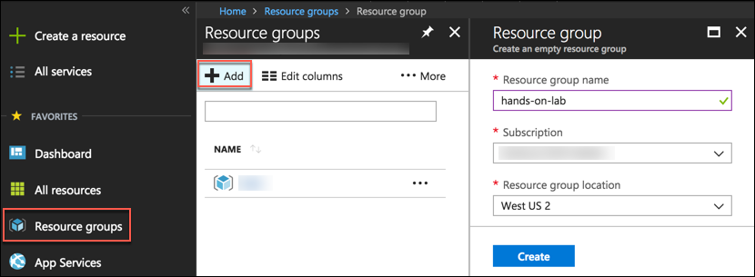

2.  Select **Create**.

### Task 2: Create a development virtual machine

In this task, you will provision an Azure virtual machine (VM) using the Visual Studio Community 2017 on Windows Server 2016 (x64) image. This will be used as your development machine throughout this lab. If you already have a machine running Visual Studio Community 2017 (or later) and would like to use it as your development machine, you can skip this task.

It is recommended you use a DS2 or D2 instance size for this VM. If you decide to use a VM, you will not be able to run the Android emulator in later steps of the lab.

1.  In the [Azure Portal](https://portal.azure.com/), select **+Create a resource**, enter "Visual Studio" into the Search the Marketplace box, and select **Visual Studio Community 2017 (latest release) on Windows Server 2016 (x64)** from the results. 

    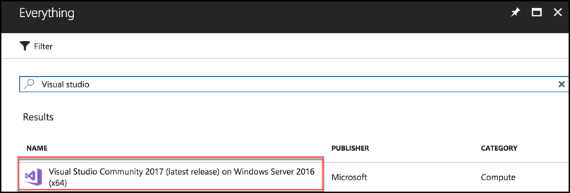

2.  On the blade that comes up, at the bottom, ensure the deployment model is set to Resource Manager, and select **Create**.

    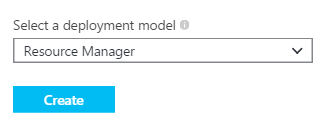

3.  Set the following configuration on the Basics tab:

    a.  **Subscription**: Select the subscription you are using for this hands-on lab.

    b.  **Resource Group**: Select the hands-on-lab-SUFFIX resource group.
    
    c.  **Name**: Enter LabVM

    d.  **Image**: Ensure **Visual Studio Community 2017 (latest release) on Windows Server 2016 (x64)** is selected.

    e.  **Username**: demouser

    f.  **Password**: Enter Password.1!!

4. Select **Change Size** and choose D2s_v3.

  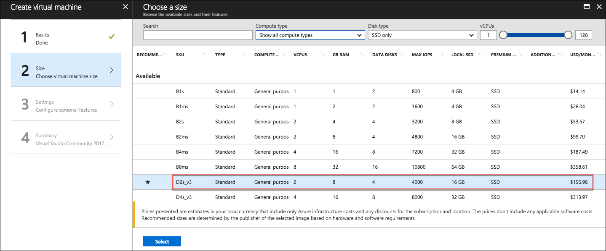

5.  On the Settings blade, locate the **Select public inbound ports** drop down, and select **RDP (3389)**     
    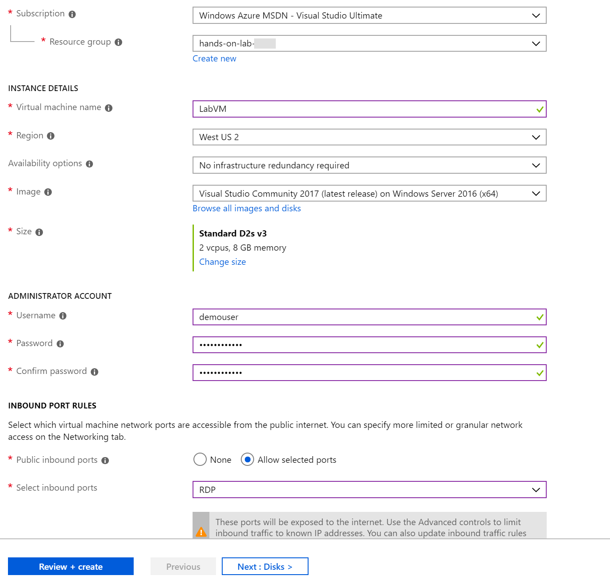
    
6.  Select **Next : Disks >** to move to the next step.

7.  Select **Premium SSD** as the OS Disk type.

8.  Select **Review + create** to move on to the Validation step.

9.  After Validation is complete, select **Create** on the Create blade to provision the virtual machine.

10. It may take 10+ minutes for the virtual machine to complete provisioning.

### Task 3: Connect to your Lab VM

In this task, you will add an inbound port rule to you Lab VM to allow SQL Server to migrate to an Azure SQL Database later in the lab. You will then open an RDP connection to your Lab VM and disable Internet Explorer Enhanced Security Configuration.

1.  From the left-hand menu in the Azure portal, select Resource groups, then enter your resource group name into the filter box, and select it from the list.
    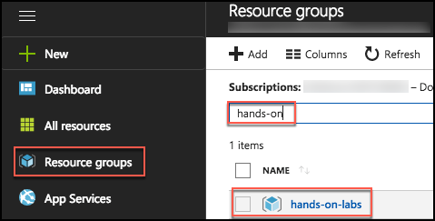

2.  Next, select your lab virtual machine, LabVM, from the list. 

    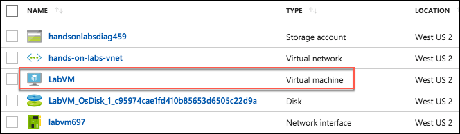

3.  Within the Settings section, select Networking, then select **Add inbound port rule**

    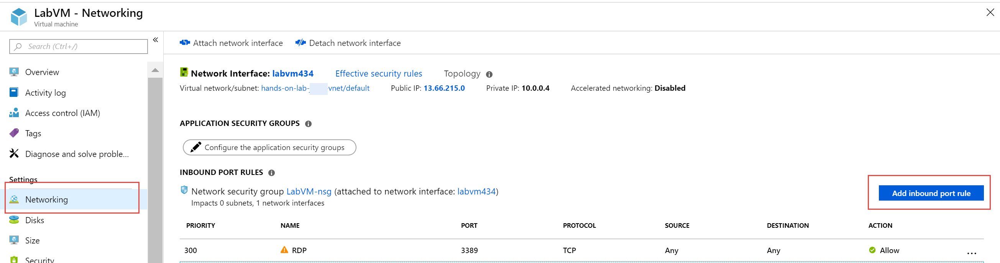

4.  Enter the following values:

    - **Source**: Any

    - **Source port range**: *

    - **Destination**: Any

    - **Destination port ranges**: 1433

    - **Protocol**: Select TCP

    - **Action**: Allow

    - **Priority**: Accept the default value

    - **Name**: SQL-Server

    > **Note**: Exposing MS SQL port 1433 as shown here is done for simplicity's sake for this hands-on lab and is **not recommended** in other cases.

    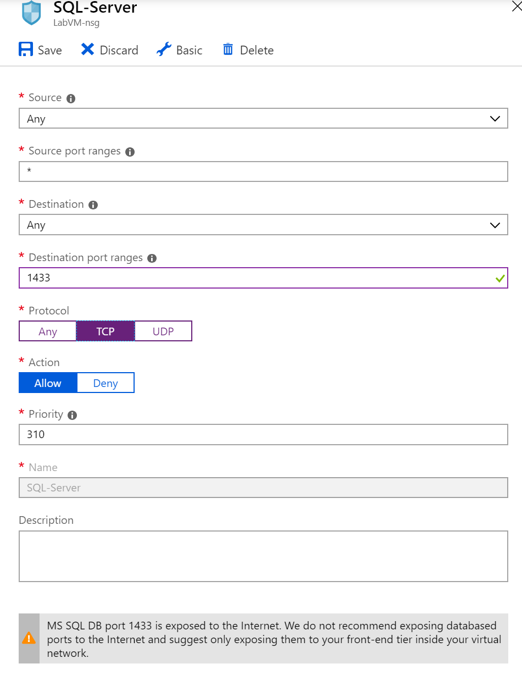

5. Select Save to finish creating the inbound port rule.

6.  On you Lab VM blade, select Connect from the top menu. 

    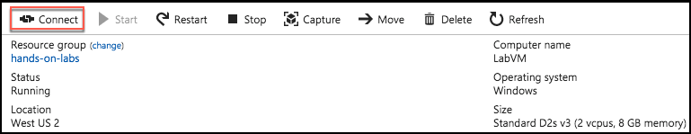

7.  Select Download RDP file, then open the downloaded RDP file.

    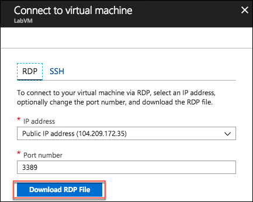

8.  Select Connect on the Remote Desktop Connection dialog. 

    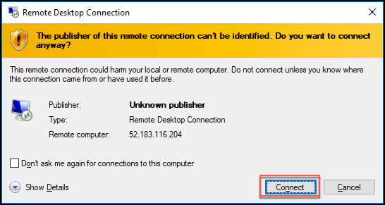

9.  Enter the following credentials when prompted:

    a.  **User name**: demouser

    b.  **Password**: Password.1!!

10.  Select Yes to connect, if prompted that the identity of the remote computer cannot be verified. 

   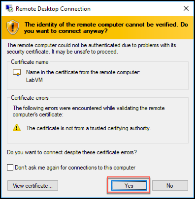

11.  Once logged in, launch the Server Manager. This should start automatically, but you can access it via the Start menu if it does not start. 

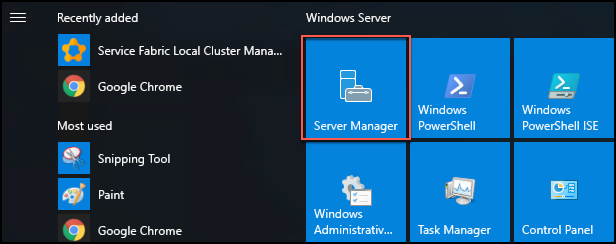

12. Select Local Server, then select **On** next to IE Enhanced Security Configuration. 

    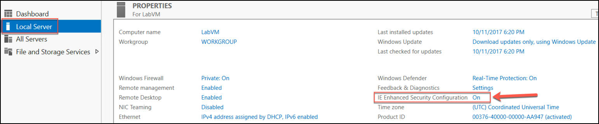

13. In the Internet Explorer Enhanced Security Configuration dialog, select Off under Administrators and Users. 

    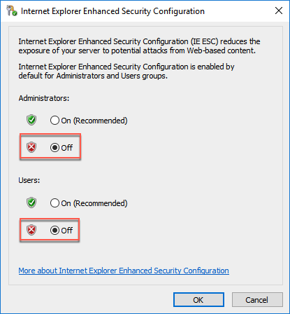

14. Select **OK**.

15. Close the Server Manager.

### Task 4: Update Visual Studio and Install Xamarin and Android SDK

In this task, you will add the Mobile Development with .NET workload to the Visual Studio Community 2017 installation on your Lab VM.

1.  On your Lab VM, launch **Visual Studio Installer**.

2.  Select **Modify** for the Visual Studio Community 2017 installation. Note: If updates are available, select the Update button first, and install the updates before moving on to installing the Xamarin components. Once the updates are installed, the Update button will be replaced with the Modify button. 

    

3.  Select the **Mobile development with .NET** workload from the Workloads screen. 

    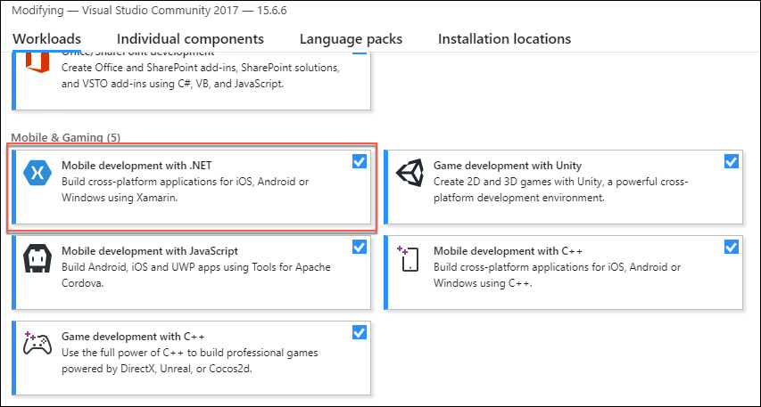

4.  While **Mobile development with .NET** is selected, look at the **Summary** panel to the right. Ensure that Android SDK Setup, Xamarin Workbooks, Google Android Emulator, Intel Hardware Accelerated Execution Manager, and Universal Windows Platform tools for Xamarin are selected.
    
    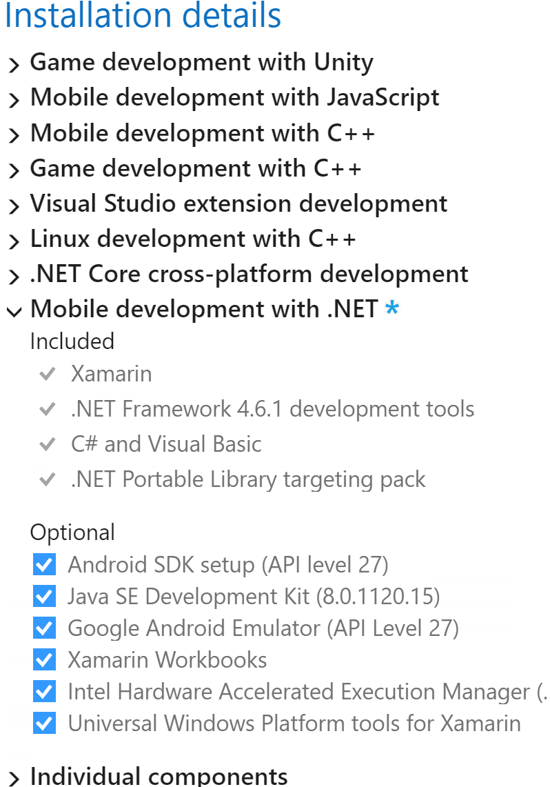

5.  Select **Modify**.

6.  Be sure to allot for extra time, since the Android SDK can be more than 3.0 GB.

### Task 5: Update Android SDKs

To complete these exercises, you will need to make sure you have all the correct Android SDKs installed.

1.  On your Lab VM, launch Visual Studio 2017 Community edition.

2.  Select **Tools \> Android \> Android SDK Manager**.

3.  When the Android SDKs and Tools dialog opens, check the bottom left corner of the dialog for an x Updates Available button. 

    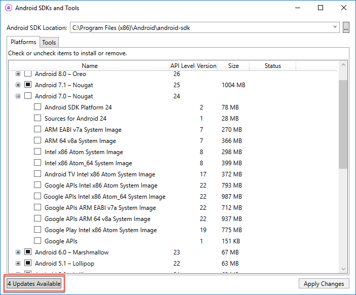

4.  If this button is visible, select it to apply any updates before selecting Android SDK platforms and tools.

    a.  Select all available updates and select Install Updates. 
    
       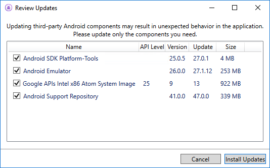

    b.  Accept any license agreements required to complete the installation.

    c.  Close the Android SDKs and Tools dialog when installation completes.

5.  On the **Platforms** tab, select each of the Android SDK platforms from 5.0 (Lollipop) to 8.0 (Oreo), selecting only the Android SDK platform box under each item (API Levels 21, 22, 23, 24, 25, and 26).

    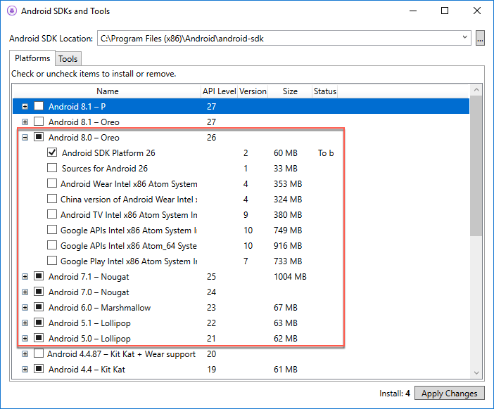

6.  Select the **Tools** tab, expand Android SDK Build Tools, and select Android SDK Build Tools 27.0.1 and Android SDK Build Tools 27.

    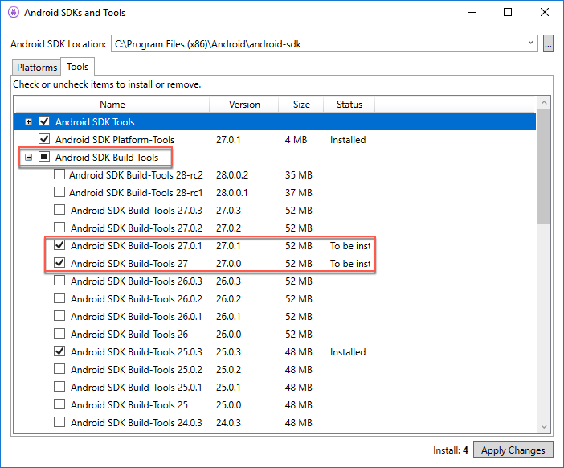

7.  Select **Apply Changes** to install the platforms and tools, accepting any license agreements required.

### Task 6: Install SQL Server 2017 Express edition

1.  On the Lab VM, download and install SQL Server 2017 Express edition from <https://www.microsoft.com/en-us/sql-server/sql-server-editions-express>.

>**Note: If you are using a machine that already has SQL Server installed**, make sure Mixed Mode authentication is enabled:    <https://technet.microsoft.com/en-us/library/ms188670(v=sql.110).aspx>.

2.  Select **Download now** on the SQL Server 2017 Express edition page. 

    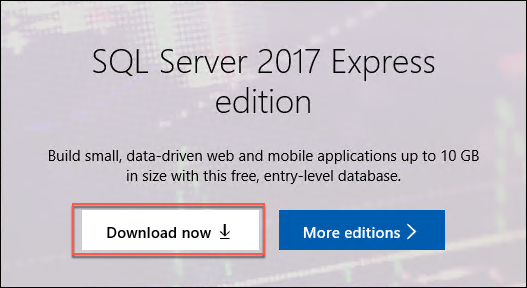

3.  If you receive a message that your current security settings do not allow this file to be downloaded, do the following:

    a.  In the top right corner of your Internet Explorer window, select **Settings**, the **Internet options**. 
    
       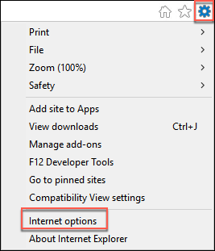

    b.  In the Internet Options dialog, select the **Security** tab, then select the **Custom level** button. 
    
       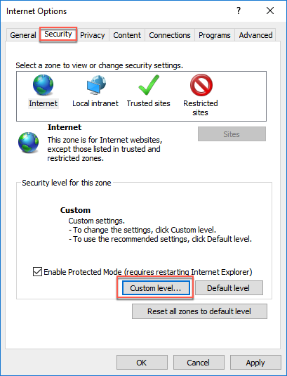

    c.  On the Security Settings dialog, scroll down until you find the **Downloads** section, and select **Enable**. 
    
       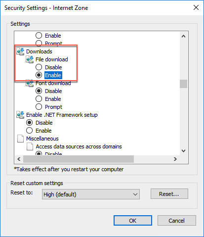

    d.  Select **OK**.

    e.  Select **OK** again on the Internet Options dialog.

    f.  Select the Download now link again on the SQL Server 2017 Express edition download page.

4.  Run the downloaded installer.

5.  Choose **Custom** installation once the install dialog box appears. 

    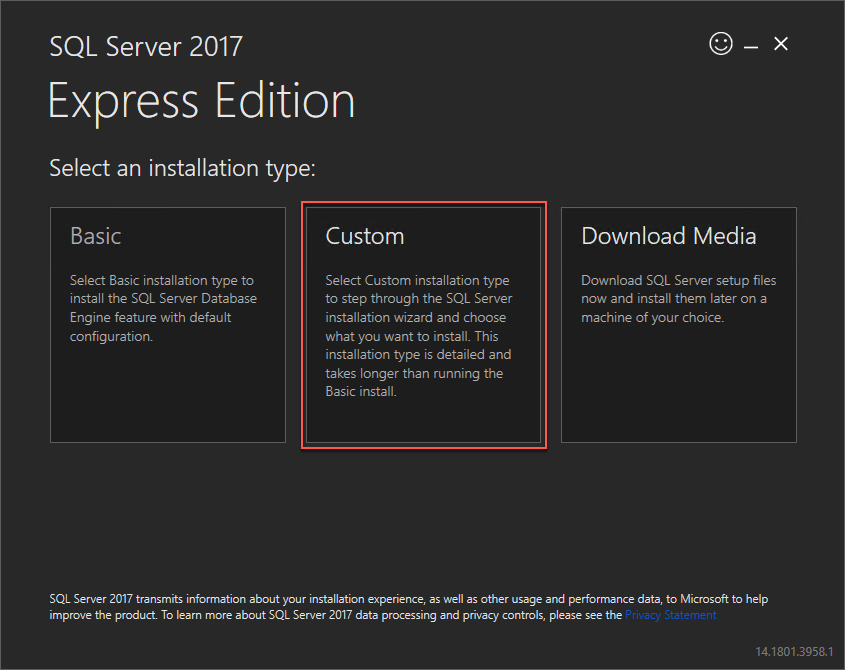

6.  Accept the default Media location and select Install. 

    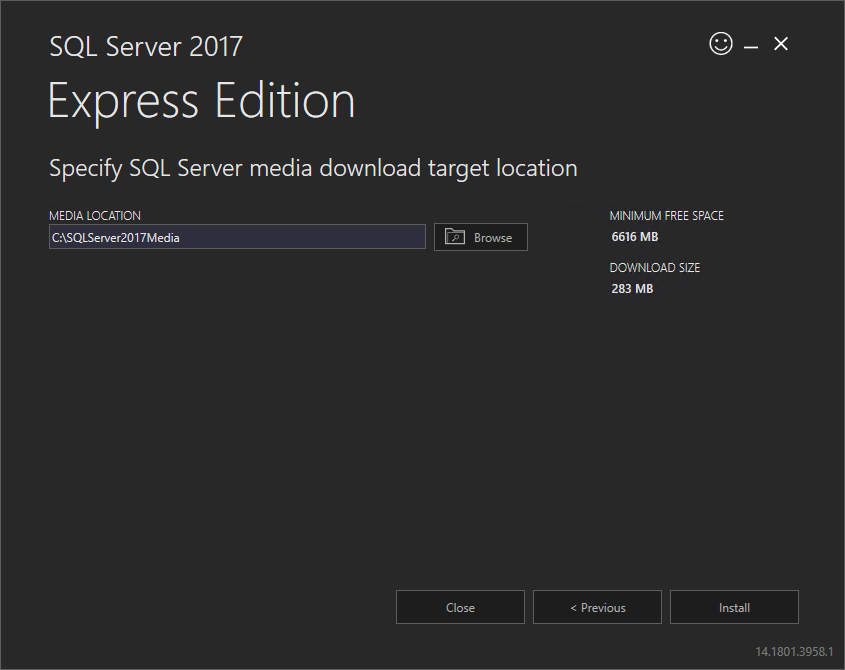

7.  When the install package finishes downloading, select **New SQL Server stand-alone installation** from the Installation tab. 

    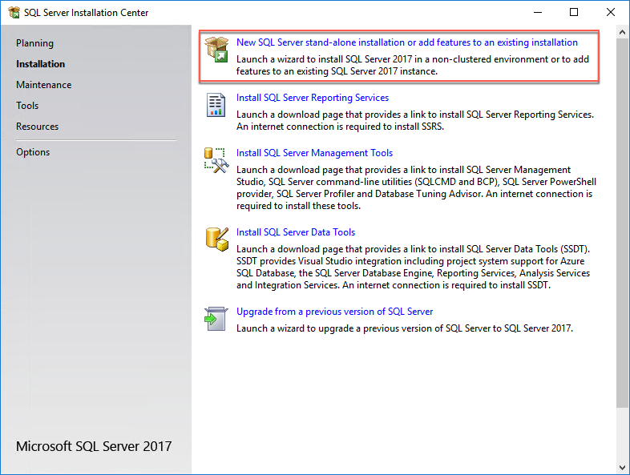

8.  Once installation starts, accept the license terms.

9.  Accept the default settings for each step until you reach the **Database Engine Configuration** section.

10. On the **Database Engine Configuration** step:

    a.  Select **Mixed Mode** under the Authentication Mode segment of the Server Configuration tab.

    b.  Specify **Password.1!!** as the password for the SA account (**Please make note of the password you entered in this step**. It will be used later when updating the connection strings in the project configuration files.)

    c.  Make sure your username is listed under Specify SQL Server administrators. If it is not, select **Add Current User** to add it.
    
    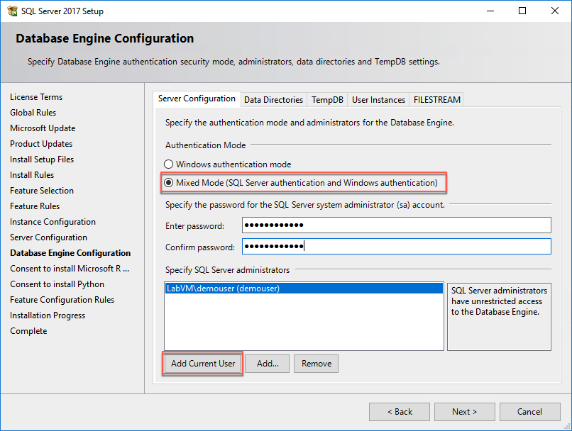

    d.  Select **Next**.

11. Complete the installation, accepting defaults for the remaining steps.

12. Select Close on the Complete screen and return to the SQL Server Installation Center for the next task.

### Task 7: Install SQL Server Management Studio

In this task, you will download and install SQL Server Management Studio (SSMS) from the SQL Server Installation Center.

1.  In the **SQL Server Installation Center**, select **Install SQL Server Management Tools** on the Installation tab.

    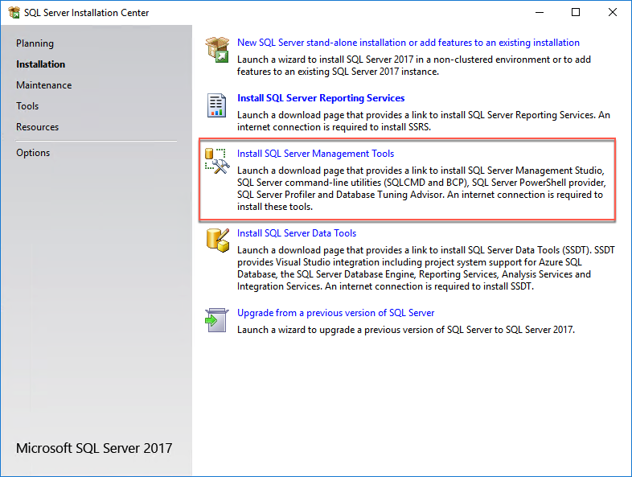

2.  This will launch a web browser window, prompting you to download the latest SQL Server Management Studio version.

3.  Select **Download SQL Server Management Studio 17.x**, then run the executable file.

    ")

4.  Once the download is complete, the Microsoft SQL Server Management Studio installation window will open. Click **Install** to complete the installation. 

    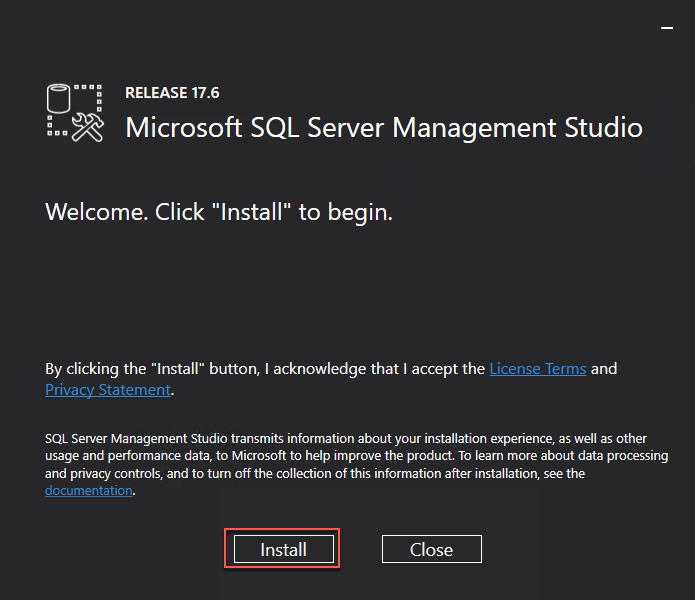

5.  Select Close when the installation is complete.

### Task 8: Download the ContosoInsurance sample application

1.  On your Lab VM, open a web browser and download the sample application from <https://bit.ly/2Nvn9aO>. 

>**Note**: Bit.ly links are case sensitive. MS Word converts hyperlinks to all lowercase, so you should copy and paste the bit.ly link into your browser.

2. When the download completes, unblock the zip file. Right click the file and select **Properties**. Check the Unblock check box. This will prevent the files within from being blocked leading to compile problems later in the lab.

  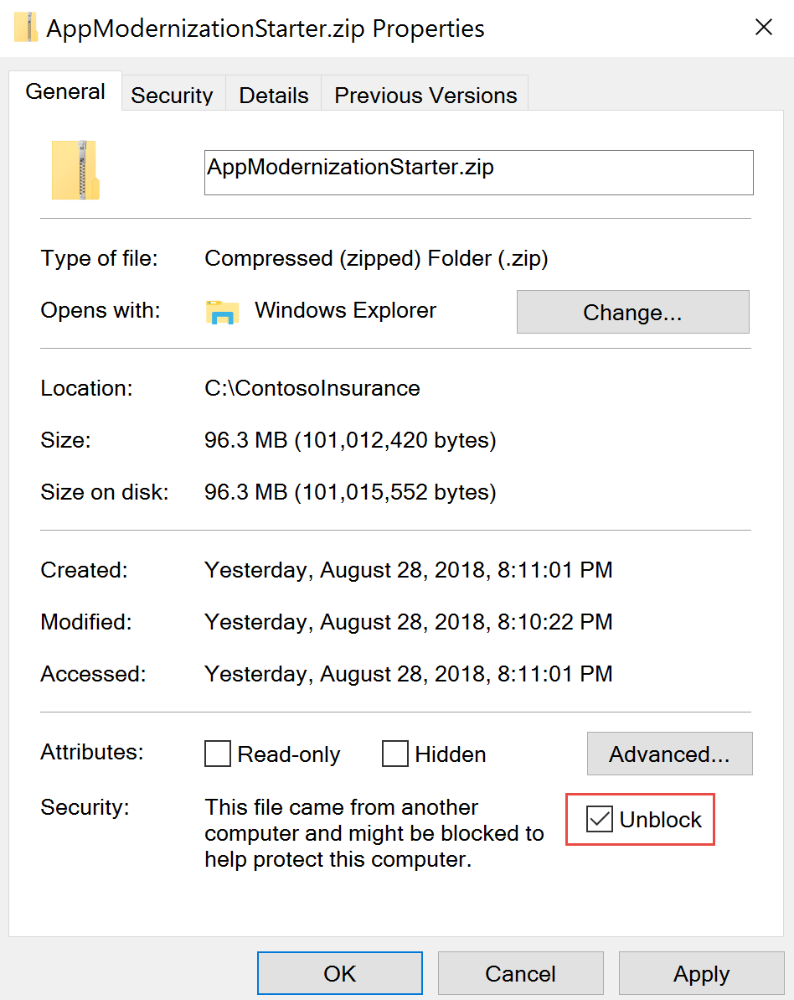

3.   Extract the ZIP file to C:\\ContosoInsurance. 

### Task 9: Attach the ContosoInsurance Database

In this task, you will attach the ContosoInsurance database to your local database instance using SSMS. This will serve as your on-premises database for the following exercises.

1.  On your Lab VM, launch **SQL Server Management Studio** (SSMS) from the Start menu.

2.  **Connect** to the local SQLEXPRESS instance using Windows Authentication. 

    

3.  Right-click on **Databases** on the left-hand menu, then select **Attach...**

4.  In the Attach Databases dialog, select the **Add...** button. 

    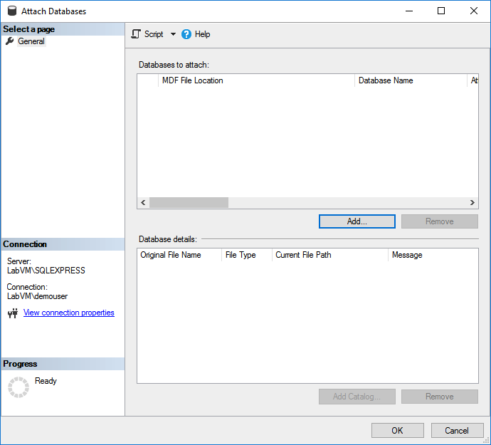

5.  In the file dialog, browse to **C:\\ContosoInsurance\\Hackathon\\Database**, select **ContosoInsurance.mdf**, and select **OK**. 

    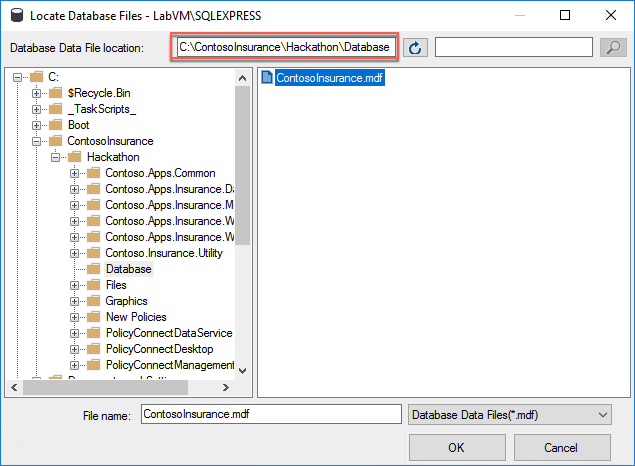

6.  Select OK on the Attach Databases dialog.

7.  You should now see the ContosoInsurance database listed underneath the Databases folder. 

    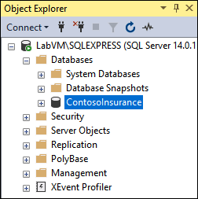

8.  Next, you need to create the ContosoUser account.

9.  Select the New Query button in the SSMS toolbar, and paste the following command into the query window:

```
    USE [master]

    GO

    CREATE LOGIN [ContosoUser] WITH PASSWORD=N'P@ss4now', DEFAULT_DATABASE=[master], DEFAULT_LANGUAGE=[us_english], CHECK_EXPIRATION=OFF, CHECK_POLICY=OFF
```

10. Select the Execute button on the toolbar or hit F5.

11. You should now see a ContosoUser listed underneath the Security Logins section of the left-hand menu.

12. Run another query to re-associate the ContosoUser login with the existing database user:

```
    Use ContosoInsurance

    EXEC sp_change_users_login 'Report'

    EXEC sp_change_users_login 'Auto_Fix', 'ContosoUser'

    EXEC sp_change_users_login 'Report'
```

You should follow all steps provided *before* attending the Hands-on lab.
