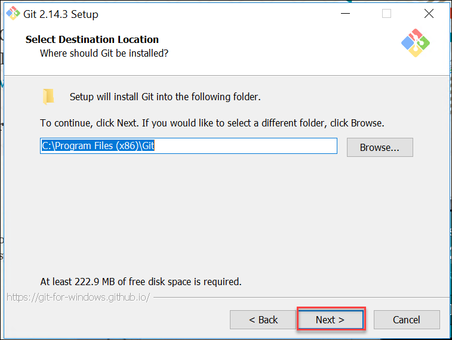

<div class="MCWHeader1">
Continuous delivery in Azure DevOps
</div>

<div class="MCWHeader2">
Before the hands-on lab setup guide
</div>

<div class="MCWHeader3">
April 2019
</div>


Information in this document, including URL and other Internet Web site references, is subject to change without notice. Unless otherwise noted, the example companies, organizations, products, domain names, e-mail addresses, logos, people, places, and events depicted herein are fictitious, and no association with any real company, organization, product, domain name, e-mail address, logo, person, place or event is intended or should be inferred. Complying with all applicable copyright laws is the responsibility of the user. Without limiting the rights under copyright, no part of this document may be reproduced, stored in or introduced into a retrieval system, or transmitted in any form or by any means (electronic, mechanical, photocopying, recording, or otherwise), or for any purpose, without the express written permission of Microsoft Corporation.

Microsoft may have patents, patent applications, trademarks, copyrights, or other intellectual property rights covering subject matter in this document. Except as expressly provided in any written license agreement from Microsoft, the furnishing of this document does not give you any license to these patents, trademarks, copyrights, or other intellectual property.

The names of manufacturers, products, or URLs are provided for informational purposes only and Microsoft makes no representations and warranties, either expressed, implied, or statutory, regarding these manufacturers or the use of the products with any Microsoft technologies. The inclusion of a manufacturer or product does not imply endorsement of Microsoft of the manufacturer or product. Links may be provided to third party sites. Such sites are not under the control of Microsoft and Microsoft is not responsible for the contents of any linked site or any link contained in a linked site, or any changes or updates to such sites. Microsoft is not responsible for webcasting or any other form of transmission received from any linked site. Microsoft is providing these links to you only as a convenience, and the inclusion of any link does not imply endorsement of Microsoft of the site or the products contained therein.

© 2019 Microsoft Corporation. All rights reserved.

Microsoft and the trademarks listed at <https://www.microsoft.com/en-us/legal/intellectualproperty/Trademarks/Usage/General.aspx> are trademarks of the Microsoft group of companies. All other trademarks are property of their respective owners.

**Contents**

<!-- TOC -->

- [Continuous delivery in Azure DevOps before the hands-on lab setup guide](#continuous-delivery-in-azure-devops-before-the-hands-on-lab-setup-guide)
  - [Requirements](#requirements)
  - [Before the hands-on lab](#before-the-hands-on-lab)
    - [Prerequisites](#prerequisites)
    - [Task 1: Configure a development environment](#task-1-configure-a-development-environment)
    - [Task 2: Disable IE enhanced security](#task-2-disable-ie-enhanced-security)
    - [Task 3: Validate connectivity to Azure](#task-3-validate-connectivity-to-azure)
    - [Task 4: Download the exercise files](#task-4-download-the-exercise-files)
    - [Task 5: Download and install Git](#task-5-download-and-install-git)

<!-- /TOC -->

# Continuous delivery in Azure DevOps before the hands-on lab setup guide

## Requirements

1.  Microsoft Azure subscription

2.  Local machine or a virtual machine configured with:

    -   Visual Studio Community 2017

    -   Git command-line interface (CLI)

## Before the hands-on lab

Duration: 30 minutes

In this lab, you will create a developer environment and download the required files for this course if you do not already have one that meets the requirements.

### Prerequisites

-   Microsoft Azure subscription <http://azure.microsoft.com/en-us/pricing/free-trial/>

-   Client computer with Windows 7 or later with Visual Studio 2017

### Task 1: Configure a development environment

If you do not have a machine setup with Visual Studio 2017 Community, complete this task.

1.  At the Azure web portal, create a virtual machine in Azure using the Visual Studio Community 2017 on Windows Server 2016 image.

    

    > It is **highly** recommended to use a DS2_v2 or D2s_v3 instance size for this VM.

    > You will also need to make sure to enable RDP (port 3389) inbound access to the VM.

### Task 2: Disable IE enhanced security

>**Note:** Sometimes this image has IE ESC disabled, and sometimes it does not.

1.  On the new VM, you just created click the Server Manager icon.

    

    Click Local Server.

    

2.  On the right side of the pane, click **On** by IE Enhanced Security Configuration.

    

3.  Change to **Off** for Administrators, and click **OK**.

    

### Task 3: Validate connectivity to Azure

1.  From within the virtual machine, Launch Visual Studio 2017 and validate that you can login with your Microsoft Account when prompted.

2.  Validate connectivity to your Azure subscription. Launch Visual Studio, open Server Explorer from the View menu, and ensure you can connect to your Azure subscription.

    

### Task 4: Download the exercise files

1.  Download the exercise files for the training (from within the virtual machine). Start by creating a new folder on your computer named **C:\\Hackathon**.

2.  Download the support files (.zip format), https://cloudworkshop.blob.core.windows.net/agile-continous-delivery/Agile-Continuous-Delivery-Student%20Files-6-2017.zip to the new folder.

3.  Extract the contents to the **C:\\Hackathon** folder.

**Tip:** In the labs, when adding resources to the Azure Resource Manager template, ensure there are no spaces at the end of the resource names. Visual Studio will include the space in all of the code it generates.

### Task 5: Download and install Git

1.  Open a web browser, and navigate to <https://git-scm.com>.

2.  If you get a prompt about Internet Explorer defaults, just click OK.
    
    

3.  Find the computer screen icon on the left that says, "Latest source Release" and click "Downloads for Windows." 

>**Note**: In this screenshot, it shows version 2.14.3 but you might see a more recent version. Use whatever version is listed on the site.
    
   

4.  The download should start; click **Run** in the security prompt.
    
    

5.  Click **Next**.
    
    

6.  Click **Next**.
    
    

7.  Click **Next**.
   
    

8.  Click **Next**.
    
    

9.  Click **"Use Git and optional Unix tools from the Windows Command Prompt**", and click **Next**.
    
    

10. Click **Next**.
    
    

11. Leave the next screen at "**Checkout Windows-style, commit Unix-style line endings**." Click **Next**.
    
    

12. On the next screen, click "**Use Windows' default console window**." Then, click **Next**.
    
    

13. Leave box check boxes checked, and click **Install**.
    
    

14. The Git install should complete. Click **Finish** on the final screen.
    
    

15. Open a **command prompt**, and type these commands on the command line:

    ```
    git config --global user.name "<your name>"
    git config --global user.email <your email>
    ```

You should follow all steps provided *before* attending the hands-on lab.
