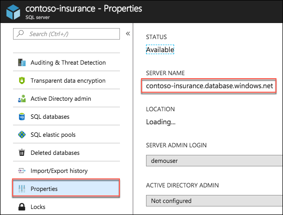
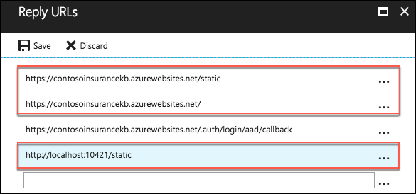
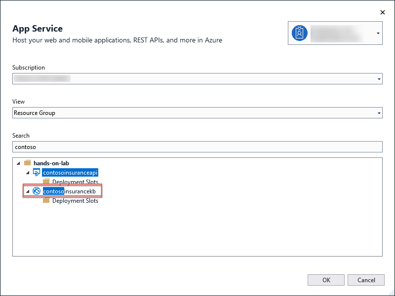
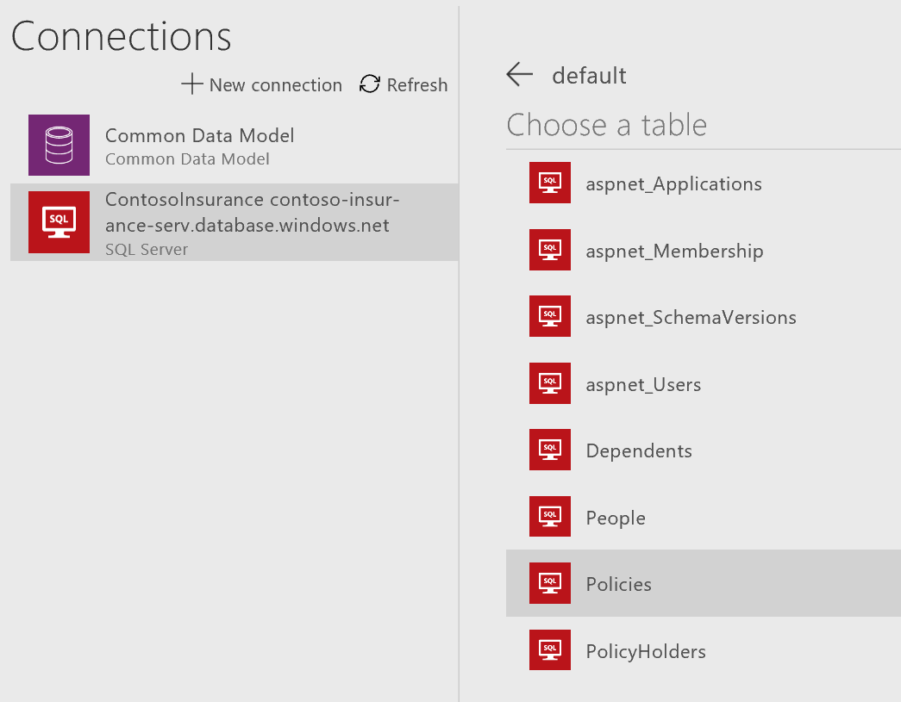
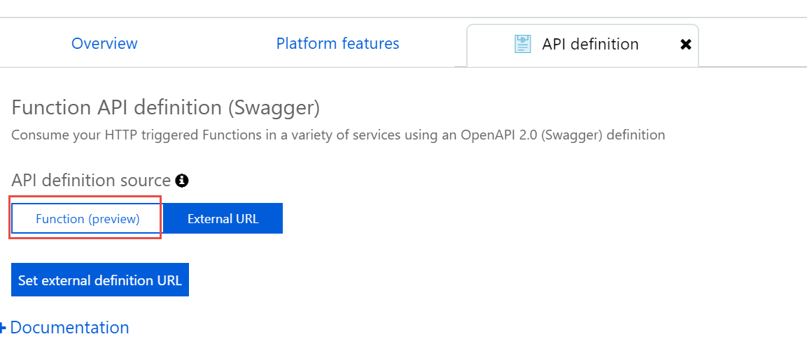

<div class="MCWHeader1">
App modernization
</div>

<div class="MCWHeader2">
Hands-on lab step-by-step
</div>

<div class="MCWHeader3">
November 2018
</div>


Information in this document, including URL and other Internet Web site references, is subject to change without notice. Unless otherwise noted, the example companies, organizations, products, domain names, e-mail addresses, logos, people, places, and events depicted herein are fictitious, and no association with any real company, organization, product, domain name, e-mail address, logo, person, place or event is intended or should be inferred. Complying with all applicable copyright laws is the responsibility of the user. Without limiting the rights under copyright, no part of this document may be reproduced, stored in or introduced into a retrieval system, or transmitted in any form or by any means (electronic, mechanical, photocopying, recording, or otherwise), or for any purpose, without the express written permission of Microsoft Corporation.

Microsoft may have patents, patent applications, trademarks, copyrights, or other intellectual property rights covering subject matter in this document. Except as expressly provided in any written license agreement from Microsoft, the furnishing of this document does not give you any license to these patents, trademarks, copyrights, or other intellectual property.

The names of manufacturers, products, or URLs are provided for informational purposes only and Microsoft makes no representations and warranties, either expressed, implied, or statutory, regarding these manufacturers or the use of the products with any Microsoft technologies. The inclusion of a manufacturer or product does not imply endorsement of Microsoft of the manufacturer or product. Links may be provided to third party sites. Such sites are not under the control of Microsoft and Microsoft is not responsible for the contents of any linked site or any link contained in a linked site, or any changes or updates to such sites. Microsoft is not responsible for webcasting or any other form of transmission received from any linked site. Microsoft is providing these links to you only as a convenience, and the inclusion of any link does not imply endorsement of Microsoft of the site or the products contained therein.

©  2018 Microsoft Corporation. All rights reserved.

Microsoft and the trademarks listed at <https://www.microsoft.com/en-us/legal/intellectualproperty/Trademarks/Usage/General.aspx> are trademarks of the Microsoft group of companies. All other trademarks are property of their respective owners.

**Contents**

<!-- TOC -->

- [App modernization hands-on lab step-by-step](#app-modernization-hands-on-lab-step-by-step)
    - [Abstract and learning objectives](#abstract-and-learning-objectives)
    - [Overview](#overview)
    - [Solution architecture](#solution-architecture)
    - [Requirements](#requirements)
    - [Exercise 1: Migrate the database to Azure SQL Database](#exercise-1-migrate-the-database-to-azure-sql-database)
        - [Task 1: Provision a SQL Server](#task-1-provision-a-sql-server)
        - [Task 2: Configure SQL Server firewall](#task-2-configure-sql-server-firewall)
        - [Task 3: Migrate the on-premises SQL database to Azure](#task-3-migrate-the-on-premises-sql-database-to-azure)
    - [Exercise 2: Provision App Services](#exercise-2-provision-app-services)
        - [Task 1: Create a Web App](#task-1-create-a-web-app)
        - [Task 2: Provision an API App](#task-2-provision-an-api-app)
    - [Exercise 3: Identity and security](#exercise-3-identity-and-security)
        - [Task 1: Create a new Contoso user](#task-1-create-a-new-contoso-user)
        - [Task 2: Register the Web API application](#task-2-register-the-web-api-application)
        - [Task 3: Expose Web API to other applications](#task-3-expose-web-api-to-other-applications)
        - [Task 4: Register the Desktop (WinForms) application](#task-4-register-the-desktop-winforms-application)
        - [Task 5: Register the mobile application](#task-5-register-the-mobile-application)
        - [Task 6: Configure access control for the PolicyConnect web application](#task-6-configure-access-control-for-the-policyconnect-web-application)
        - [Task 7: Grant the ContosoInsurance Web app permissions to the Web API app](#task-7-grant-the-contosoinsurance-web-app-permissions-to-the-web-api-app)
    - [Exercise 4: Upload PDFs to blob storage](#exercise-4-upload-pdfs-to-blob-storage)
        - [Task 1: Provision a storage account](#task-1-provision-a-storage-account)
        - [Task 2: Create container for storing PDFs in Azure storage](#task-2-create-container-for-storing-pdfs-in-azure-storage)
        - [Task 3: Bulk upload PDFs to blob storage using AzCopy](#task-3-bulk-upload-pdfs-to-blob-storage-using-azcopy)
    - [Exercise 5: Create serverless API for accessing PDFs](#exercise-5-create-serverless-api-for-accessing-pdfs)
        - [Task 1: Provision a Function App](#task-1-provision-a-function-app)
        - [Task 2: Retrieve URL for policy documents in Azure storage](#task-2-retrieve-url-for-policy-documents-in-azure-storage)
        - [Task 3: Create an Azure Functions Proxy](#task-3-create-an-azure-functions-proxy)
        - [Task 4: Parameterize Azure Functions Proxy](#task-4-parameterize-azure-functions-proxy)
    - [Exercise 6: Create an Azure Search service](#exercise-6-create-an-azure-search-service)
        - [Task 1: Create an Azure search service](#task-1-create-an-azure-search-service)
        - [Task 2: Configure full-text search indexing](#task-2-configure-full-text-search-indexing)
    - [Exercise 7: Configure Key Vault](#exercise-7-configure-key-vault)
        - [Task 1: Create a new Key Vault](#task-1-create-a-new-key-vault)
        - [Task 2: Create a new secret to store the SQL connection string](#task-2-create-a-new-secret-to-store-the-sql-connection-string)
        - [Task 3: Grant access to the secret to the Web API application](#task-3-grant-access-to-the-secret-to-the-web-api-application)
    - [Exercise 8: Configure and deploy the Contoso Insurance Web API](#exercise-8-configure-and-deploy-the-contoso-insurance-web-api)
        - [Task 1: Add Application Settings to the API App](#task-1-add-application-settings-to-the-api-app)
        - [Task 2: Deploy the Web API app from Visual Studio](#task-2-deploy-the-web-api-app-from-visual-studio)
        - [Task 3: Verify the Web API deployment](#task-3-verify-the-web-api-deployment)
    - [Exercise 9: Configure and deploy the Contoso Insurance web app](#exercise-9-configure-and-deploy-the-contoso-insurance-web-app)
        - [Task 1: Configure application settings in Azure](#task-1-configure-application-settings-in-azure)
        - [Task 2: Deploy the Contoso Insurance Web App from Visual Studio](#task-2-deploy-the-contoso-insurance-web-app-from-visual-studio)
        - [Task 3: Login and verify the Web App deployment](#task-3-login-and-verify-the-web-app-deployment)
    - [Exercise 10: Configure and run the legacy desktop (Windows Forms) application](#exercise-10-configure-and-run-the-legacy-desktop-windows-forms-application)
        - [Task 1: Configure application settings in App.config](#task-1-configure-application-settings-in-appconfig)
        - [Task 2: Run the desktop application](#task-2-run-the-desktop-application)
    - [Exercise 11: Configure and run the mobile application](#exercise-11-configure-and-run-the-mobile-application)
        - [Task 1: Configure application settings in ApplicationSettings.cs](#task-1-configure-application-settings-in-applicationsettingscs)
        - [Task 2: Run the mobile application](#task-2-run-the-mobile-application)
    - [Exercise 12: Create a Flow app to send push notifications](#exercise-12-create-a-flow-app-to-send-push-notifications)
        - [Task 1: Sign up for a Flow account](#task-1-sign-up-for-a-flow-account)
        - [Task 2: Create new flow](#task-2-create-new-flow)
        - [Task 3: Test your flow](#task-3-test-your-flow)
    - [Exercise 13: Create an app in PowerApps](#exercise-13-create-an-app-in-powerapps)
        - [Task 1: Sign up for a PowerApps account](#task-1-sign-up-for-a-powerapps-account)
        - [Task 2: Create new SQL connection](#task-2-create-new-sql-connection)
        - [Task 3: Create a new app](#task-3-create-a-new-app)
        - [Task 4: Design app](#task-4-design-app)
        - [Task 5: Edit the app settings and run the app](#task-5-edit-the-app-settings-and-run-the-app)
    - [Exercise 14: Add Azure Function to Azure API Management](#exercise-14-add-azure-function-to-azure-api-management)
        - [Task 1: Provision Azure API Management](#task-1-provision-azure-api-management)
        - [Task 2: Add API Definition to Function App](#task-2-add-api-definition-to-function-app)
        - [Task 3: Import the Function App to API Management(APIM)](#task-3-import-the-function-app-to-api-managementapim)
    - [After the hands-on lab](#after-the-hands-on-lab)
        - [Task 1: Delete the Resource group in which you placed your Azure resources.](#task-1-delete-the-resource-group-in-which-you-placed-your-azure-resources)
        - [Task 2: Delete the Azure Active Directory app registrations for Desktop and Mobile](#task-2-delete-the-azure-active-directory-app-registrations-for-desktop-and-mobile)
        - [Task 3: Delete Flow](#task-3-delete-flow)
    - [Appendix A: Create a self-signed certificate](#appendix-a-create-a-self-signed-certificate)
        - [Task 1: Create self-signed certificate](#task-1-create-self-signed-certificate)
        - [Task 2: Create and install your temporary service certificate](#task-2-create-and-install-your-temporary-service-certificate)
        - [Task 3: Configure the IIS Express self-signed certificate](#task-3-configure-the-iis-express-self-signed-certificate)

<!-- /TOC -->

# App modernization hands-on lab step-by-step

## Abstract and learning objectives

In this hands-on lab, you will implement the steps to modernize legacy on-premises applications and infrastructure by leveraging cloud services, while adding a mix of web and mobile services, all secured using Azure Active Directory.

At the end of this hands-on lab, you will be better able to build solutions for modernizing legacy on-premises applications and infrastructure using cloud services, and implement a mix of web and mobile services secured by Azure Active Directory.

## Overview

The App Modernization hands-on lab is an exercise that will challenge you to implement an end-to-end scenario using a supplied sample that is based on Microsoft Azure App Services and related services. The scenario will include implementing compute, storage, security, and search, using various components of Microsoft Azure. The hands-on lab can be implemented on your own, but it is highly recommended to pair up with other members at the lab to model a real-world experience and to allow each member to share their expertise for the overall solution.

## Solution architecture

After lawyers affirmed that Contoso, Ltd. could legally store customer data in the cloud, Contoso created a strategy that capitalized on the capabilities of Microsoft Azure. Below is a diagram of the solution architecture you will build in the lab. Please study this carefully, so you understand the whole of the solution as you are working on the various components.


The solution begins with mobile apps (built for Android and iOS using **Xamarin**) and a website, both of which provide access to PolicyConnect. The website, hosted in a **Web App**, provides the user interface for browser-based clients, whereas the Xamarin Forms-based apps provide the UI to mobile devices. Both mobile app and website rely on web services hosted in an **API App**. In addition to the API App, a light-weight, serverless API is provided by **Azure Functions Proxies** to provide access to policy documents stored in **Blob Storage**. **Azure API Management** is used as a proof of concept for the future goal to create an API Store for development teams and affiliated partners. Sensitive configuration data, like connection strings, are stored in **Key Vault** and accessed from the API App or Web App on demand so that these settings never live in their file system. Full-text search of policy documents is enabled by the Indexer for **Blob Storage** (which indexes text in the Word and PDF documents) and stores the results in an **Azure Search** index. **PowerApps** enable authorized business users to build mobile and web create, read, update, delete (CRUD) applications that interact with **SQL Database** and Azure Storage, while **Microsoft Flow** enables them to orchestrations between services such as Office 365 email and services for sending mobile notifications. These orchestrations can be used independently of PowerApps or invoked by PowerApps to provide additional logic. The solution uses user and application identities maintained in **Azure AD**.

## Requirements

-   Microsoft Azure subscription (non-Microsoft subscription).

-   **Global Administrator role** for Azure AD within your subscription.

-   Local machine or a virtual machine configured with (**complete the day before the lab!**):

    -   Visual Studio Community 2017 or greater

    -   Visual Studio 2017 workloads for:

        -   Azure development

        -   Mobile development with .NET

    -   SQL Server 2017 Express or greater

    -   SQL Server Management Studio (SSMS)

    -   PowerShell 1.1.0 or higher

## Exercise 1: Migrate the database to Azure SQL Database

Duration: 15 minutes

Contoso Insurance has asked you to migrate their on-premises SQL database to Azure SQL Database. In this exercise, you will provision a new SQL Server in Azure, configure the firewall for that SQL Server, and then use SSMS to migrate the Contoso Insurance database from on-premises to Azure SQL Database.

### Task 1: Provision a SQL Server

In this task, you will create a SQL Server (logical server). You will not create the databases at this time since it will be created during the database migration step.

1.  In a web browser, navigate to the Azure portal (<http://portal.azure.com>).

2.  Select **+Create a resource**, enter **SQL Server** into the Search the Marketplace box and select **SQL Server (logical server)** from the results. 

    

3.  Select **Create** on the SQL server (logical server) blade.

4.  On the **SQL Server (logical server on...)** blade, specify the following configuration:

    a.  **Server name**: Enter a unique value, such as contoso-insurance-SUFFIX (ensure the green checkmark appears).

    b.  **Server admin login**: demouser

    c.  **Password**: Password.1!!

    d.  **Resource group**: Select the hands-on-lab-SUFFIX resource group.

    e.  **Location**: Select the same location you used for the hands-on-lab-SUFFIX resource group.
    
 
     blade")

5.  Select **Create**.

### Task 2: Configure SQL Server firewall

In this task, you will create a firewall rule to allow access to your SQL Server.

1.  After the SQL Server finishes provisioning, navigate to it by select Resource groups from the left-hand menu in the Azure portal, then enter your resource group name into the filter box, and select it from the list. 

    

2.  Select your SQL Server from the resources in the group. 

    

3.  On the **SQL Server** blade, select **Firewalls and virtual networks** under Security.

4.  On the **Firewalls and virtual networks** blade, specify a new rule named **ALL**, with START IP **0.0.0.0**, and END IP **255.255.255.255**, then select **Save**. 

    

    > **Note**: Adding all IP address ranges as shown here is done for simplicity's sake for this hands-on lab and is **not recommended** in other cases. The correct approach is to add only the necessary IPs and consider limiting access to Azure SQL through AAD ( <https://docs.microsoft.com/en-us/azure/sql-database/sql-database-aad-authentication>).

5.  On the Success dialog box, select **OK**.

### Task 3: Migrate the on-premises SQL database to Azure

In this task, you will migrate the Contoso Insurance database from on-premises (Lab VM) into Azure SQL Database.

1.  On your Lab VM, open SSMS from the Start menu.

2.  Connect to your local SQL Express instance, as you did previously, and expand the Databases node in the Object Explorer.

3.  Right-click the Contoso Insurance database and select Tasks Deploy Database to Microsoft Azure SQL Database. 

    

4.  In the Deploy Database 'ContosoInsurance' dialog, select **Next** to begin.

5.  On the Deployment Settings tab, select **Connect** next to Server Connection. 

    

6.  In the Connect to Server dialog, enter the server name of the Azure SQL server you created previously. You can find this by navigating to your SQL Server in the Azure portal and selecting Properties. 

    

7.  Next, set Authentication to SQL Server Authentication and enter the following credentials:

    a.  **Login**: demouser

    b.  **Password**: Password.1!!

8.  Check **Remember password**.

9.  Select **Connect**. 

    

10. You should now see the Azure SQL server name in the Server connection box. Verify the new database name is **ContosoInsurance** and select **Next**. 

    

11. Verify the settings are correct and select **Finish**.

12. When the operation has completed, close the database deployment dialog. You should see green checkmarks next to each completed step, along with a large checkmark next to Operation Complete.

    

   >  **Note**: If you receive an error during the import stage like the following, you need to make sure you are using the latest version of SQL Server Management Studio. This error can be caused by newer Azure SQL compatibility levels not being supported by older versions of SSMS, or if you did not set your SQL Server firewall settings:

   > "Unable to connect to master or target server \'ContosoInsurance\'. You must have a user with the same password in master or target server \'ContosoInsurance\'."

13. You can verify that the database is operational, and its tables populated by connecting to it through SSMS, using the same credentials used in Step 7 above.

## Exercise 2: Provision App Services

Duration: 15 minutes

Contoso Insurance has asked you to provision resources in Azure for hosting their web and API applications. In this exercise you will create a Web App and an API App in Azure.

### Task 1: Create a Web App

In this task, you will provision a Web App and API App for hosting the Contoso Insurance applications in Azure.

1.  In the Azure portal (<http://portal.azure.com>), create a new **Web App** by selecting **+Create a resource**, enter "web app" in the Marketplace search box, and selecting the **Web App** item in the results. 

    

2.  Select **Create** on the Web App blade.

3.  On the **Web App Create** blade, specify the following configuration:

    a.  **App name**: Enter a unique and valid URL, such as contosoinsuranceSUFFIX (until the green check mark appears) in the App Name field.

    b.  **Subscription**: Select the subscription you are using for this hands-on lab.

    c.  **Resource group**: Select Use existing, and select the **hands-on-lab-SUFFIX** resource group.

    d.  Select **App Service plan/Location**.

    e. On the App Service plan blade, select Create new.

    f. On the New App Service Plan blade, enter the following:

    -  **App Service plan**: Enter a unique name, such as contosoinsuranceSUFFIX.

    -  **Location**: Select the location you are using for this hands-on lab.

    -  **Pricing tier**: Select S1 Standard.
    
    

    -  Select **OK**.

4.  Select **Create** to provision the new Web App. 

    

### Task 2: Provision an API App

1.  In the Azure portal (<http://portal.azure.com>), select **+Create a resource**, enter "api app" in the Marketplace Search box, and select **API App** from the results. 

    

2.  Select **Create** on the API App blade.

3.  On the API App Create blade, enter the following:

    a.  **App name**: Enter a unique name, such as contosoinsuranceapiSUFFIX.

    b.  **Subscription**: Select the subscription you are using for this hands-on lab.

    c.  **Resource group**: Choose Use existing, and select the **hands-on-lab-SUFFIX** resource group.

    d.  **App Service plan/Location**: Select the contosoinsuranceSUFFIX plan you created for the Web App.
    
    

4.  Select **Create**.

## Exercise 3: Identity and security

Duration: 45 minutes

Azure Active Directory (Azure AD) will be used to allow users to authenticate to the web app, PolicyConnect desktop app, mobile apps, and PowerApps solutions. Azure AD will also be used to manage application access to Key Vault secrets. You have been asked to create a new Azure AD Tenant and secure the application so only users from the tenant can log on.

>**Note**: Tasks 1 and 2 require global admin permissions on the Azure AD Tenant and cannot be completed if you use Microsoft's Azure AD tenant. Task 3 requires the permission to create an app in the Azure AD tenant.

### Task 1: Create a new Contoso user

In this task, you will create an Azure AD user account that will be used for authenticating against the web and mobile apps.

>**Note**: This task is valid only if you are a global administrator on the Azure AD tenant associated with your subscription.

1.  In the [Azure Portal](https://portal.azure.com), select **Azure Active Directory** from the left-hand menu. 

    

2.  Ensure the correct Azure AD tenant is selected. You must be a Global Administrator for the selected tenant to complete the exercise. If you need to change it, select **Switch directory**. 

    

3.  Under Manage, select **Users**, **All Users**, then select **+New User**. 

    

4.  On the User blade, enter the following:

    a.  **Name**: Contoso User

    b.  **User name**: [contosouser@\[YOUR-TENANT\].onmicrosoft.com](mailto:contosouser@[YOUR-TENANT].onmicrosoft.com) (Note this full user name for later use.)

    c.  **Profile**: On the profile blade, enter:

        i.  **First name**: Contoso

        ii. **Last name**: User

        iii. Select **OK**

    d.  Check the **Show Password** box and select the Click to copy button to copy the password.

    e.  Paste the password into a text editor, such as Notepad.exe, for later use.

    f.  Select **Create**.
    
    

### Task 2: Register the Web API application

1.  Open **Azure Active Directory** from the left-hand menu in the Azure portal, select **App registrations**, and select **+New application registration**. 

    

2.  In the Create blade, enter the following:

    a.  **Name**: Contoso Insurance Web API.

    b.  **Application type**: Select Web app / API.

    c.  **Sign-on URL**: [https://\[YOUR-WEB-API-NAME\].azurewebsites.net](https://[YOUR-WEB-API-NAME].azurewebsites.net) (You can retrieve this value from your API App's blade.) 
    
    

    d.  Select **Create**.

3.  On the Contoso Insurance Web API Registered app blade, select **Settings**, then select Keys on the Settings blade. 


4.  On the Keys blade, create a new key by enter the following:

    e.  **Key description**: Enter apikey.

    f.  **Duration**: Select In 1 year.

    g.  Select **Save**.
    
    

5.  Don't miss this step! After saving, the value of the key will be displayed. Copy this value and paste it into a text editor for later reference.

    

6.  Close the Keys blade.

7.  Back on the Settings blade, select Reply URLs, and copy the reply URL for later use. 

    

8.  Close the Reply URLs blade.

9.  On the Settings blade, select Properties, and copy the Application ID and App ID URI values and paste them into a text edit for later reference. 

    

10. Bonus: On the Properties blade, select the browse button next to Upload new logo. Browse to the C:\\ContosoInsurance\\Hackathon\\Graphics folder and select the file names **CI-Icon-215x215.png**. You will now have the Contoso Insurance Logo associated with the API App! 

    

11. Select **Save** on the Properties blade.

### Task 3: Expose Web API to other applications 

To make the Web API accessible to other applications added to Azure AD, you must define the appropriate permissions. You will modify the manifest for the Web API to configure these settings, since, as of now, the Azure portal does not provide an interface for this.

1.  Within the Azure Active Directory blade, select **App registrations**, and select your Web API application. 

    

2.  On the Contoso Insurance Web API blade, select **Manifest**. 
    
    

3.  On the Edit manifest blade, locate the **oauth2AllowImplicitFlow** setting, and change its value to **true**. This will allow JavaScript calls to the Web API from the web application. 

    

4.  Next, locate the **oauth2Permissions** setting. This setting will be populated with a value.

    , 
    
    Copy the id property as you will need it at the end of this step. 

5.  You are going modify the permission in this array. (Copy the text below and paste it over the top of the existing permission):
    ```
    {
        "adminConsentDescription": "Allow read-write access to the Contoso Insurance Web API on behalf of the signed-in user",
        "adminConsentDisplayName": "Read-Write access to Contoso Insurance Web API",
        "id": "<REPLACE-WITH-THE-ID-YOU-COPIED>",
        "isEnabled": true,
        "type": "User",
        "userConsentDescription": "Allow read-write access to the Contoso Insurance Web API on your behalf",
        "userConsentDisplayName": "Read-Write access to Contoso Insurance Web API",
        "value": "Read_Write_ContosoInsurance_WebAPI"
    }

    ```

6.  Paste the id value you set aside into the id property.


7.  The result should look like this: 

    

8.  Select **Save** to commit the changes. 

    

### Task 4: Register the Desktop (WinForms) application 

1.  Open **Azure Active Directory** from the left-hand menu in the Azure portal, select **App registrations**, and select **+New application registration**. 

    

2.  On the Create blade, enter the following:

    a.  **Name**: Contoso Insurance Desktop

    b.  **Application type**: Select Native

    c.  **Redirect URI**: <http://contosoinsurance.desktop.client> (It does not matter if this path is exact. What is important is that the URI for each application is valid and unique for every application in your directory. The Redirect URI is used to identify your app). 
    
    

    d.  Select **Create**.

3.  On the Contoso Insurance Desktop Registered app blade, select Settings, then select Redirect URIs, and copy the redirect URI into a text editor for later use. 

    

4.  Close the Redirect URIs blade.

5.  Back on the Settings blade, select **Required Permissions**, then select **+Add**. 

    

6.  On the Add API access blade, select **Select an API**, enter "contoso" into the search box, and select **Contoso Insurance Web API** from the list of available APIs. 

    

7.  Select **Select**.

8.  On the Enable Access blade, check "Read-write access to Contoso Insurance Web API" and select **Select**. 

    

9.  Select **Done** on the Add API access blade and close the Required permission blade.

10. Back on the Settings blade, select **Properties**, copy the **Application ID** value and paste it into a text editor for later reference. 

    

11. Bonus: On the Properties blade, select the browse button next to Upload new logo. Browse to the C:\\ContosoInsurance\\Hackathon\\Graphics folder and select the file names **CI-Icon-215x215.png**. You will now have the Contoso Insurance Logo associated with the Desktop App!

    

12. Select **Save**.

### Task 5: Register the mobile application 

1.  Open **Azure Active Directory** from the left-hand menu in the Azure portal, select **App registrations**, and select **+New application registration**. 

    

2.  On the Create blade, enter the following:

    a.  **Name**: Contoso Insurance Mobile

    b.  **Application type**: Select Native.

    c.  **Redirect URL**: <http://contosoinsurance.mobile.client> (It does not matter if this path is exact. What is important is that the URI for each application is valid and unique for every application in your directory. The Redirect URI is used to identify your app.) 
    
    

    d.  Select **Create**.

3.  On the Contoso Insurance Mobile Registered app blade, select **Settings**, then select Redirect URIs, and copy the redirect URI into a text editor for later reference. 

    

4.  Close the Redirect URIs blade.

5.  Back on the Settings blade, select **Required Permissions**, then select **+Add**. 

    

6.  On the Add API access blade, select **Select an API**, enter "contoso" into the search box, and select **Contoso Insurance Web API** from the list of available APIs. 

    

7.  Select **Select**.

8.  On the Enable Access blade, check "Read-write access to Contoso Insurance Web API" and select **Select**. 

9.  Select **Done** on the Add API access blade and close the Required permission blade.

10. Back in the Settings blade, select **Properties**, copy the **Application ID** value and paste it into a text editor for later reference. 

    

11. Bonus: On the Properties blade, select the browse button next to Upload new logo. Browse to the C:\\ContosoInsurance\\Hackathon\\Graphics folder and select the file names **CI-Icon-215x215.png**. You will now have the Contoso Insurance Logo associated with the Mobile App! 

    

12. Select **Save**.

### Task 6: Configure access control for the PolicyConnect web application

1.  In the [Azure Portal](https://portal.azure.com), navigate to your web app by selecting Resource groups from the Azure navigation menu, selecting the hands-on-lab-SUFFIX resource group, and then selecting your Web app from the list of available resources. 

    

2.  Select the **Authentication / Authorization** tile underneath the list of settings.

3.  On the Authentication / Authorization blade:

    a.  **App Service Authentication**: Select On.

    b.  **Action to take when request is not authorized**: Select Log in with Azure Active Directory.

    c.  **Authentication Providers**: Select Azure Active Directory, then on the Azure Active Directory Settings blade set the **Management mode** to **Express**, and select **OK**.
    
    

    d.  Select **Save**.

### Task 7: Grant the ContosoInsurance Web app permissions to the Web API app 

1.  Open **Azure Active Directory** from the left-hand menu in the Azure portal, select **App registrations**, and select your web application, which was automatically added to Azure AD in the previous task. (You may need to select View all applications to see the list of applications). 

    

2.  In the Web App blade, select **Manifest**. 

3.  In the Edit manifest blade, look for the **oauth2AllowImplicitFlow** setting, and set the value to **true**. This is required for our JavaScript Web API service calls from the web application. 

    

4.  Select **Save** and close the Edit manifest blade.

5.  Back in the Web App blade, select **Settings**, then select **Reply URLs**. 

    

6.  On the Reply URLs blade, two new reply URLs need to be added for our application to work correctly:

    a.  Enter: [https://\[YOUR-WEB-APP-NAME\].azurewebsites.net/](https://[YOUR-WEB-APP-NAME].azurewebsites.net/)

    b.  Enter: [https://\[YOUR-WEB-APP-NAME\].azurewebsites.net/static](https://[YOUR-WEB-APP-NAME].azurewebsites.net/static)

    c.  OPTIONAL: If you intend to debug the web app locally from within Visual Studio, you will need to add the **localhost** path (http://localhost:10421/static) to the list of Reply URLs as well. Otherwise, your AAD auth to the Web API will fail. 
    
    

    d.  Select **Save**.

7.  Close the Reply URLs blade.

8.  Back in the Settings blade, select **Required permissions**, then select **+Add**. 

    

9.  On the Add API access blade, select **Select an API**, enter "contoso" in the search box, select the **Contoso Insurance Web API** from the list of APIs, and select **Select**. 

    

10. On the Enable Access blade, check "Read-write access to Contoso Insurance Web API" and select **Select**. 

    

11. Select **Done** on the Add API access blade.

12. Back on the Settings blade, select **Properties**, copy the **Application ID** and **App ID URI** values, and paste them into a text editor for later reference. 


13. Bonus: On the Properties blade, select the browse button next to Upload new logo. Browse to the C:\\ContosoInsurance\\Hackathon\\Graphics folder and select the file names **CI-Icon-215x215.png**. You will now have the Contoso Insurance Logo associated with the Mobile App! 

    

14. Select **Save**.

## Exercise 4: Upload PDFs to blob storage

Duration: 15 minutes

Contoso Insurance is currently storing all of their scanned PDF documents on a local network share. They have asked to be able to store them in the cloud automatically from a workflow. In this exercise, you will provision a storage account that will be used to store the files in a blob container. Then, you will provide a way to bulk upload their existing PDFs.

### Task 1: Provision a storage account

1.  In the [Azure Portal](https://portal.azure.com/), select **+Create a resource**, enter "storage account" into the Search the Marketplace box, and select **Storage account -- blob, file, table, queue** from the results. 

    

2.  Select **Create** on the Storage account blade.

3.  On the Create storage account blade, enter the following:

    a.  **Name**: Enter a unique value, such as contosoinsuranceSUFFIX (ensure the green check mark appears).

    b.  **Deployment model**: Select Resource manager.

    c.  **Account kind**: Select Storage (general purpose v1).

    d.  **Location**: Select the same region as the resource group.

    e.  **Replication**: Select Locally-redundant storage (LRS).

    f.  **Performance**: Select Standard.

    g.  **Secure transfer required**: Select Disabled.

    h.  **Subscription**: Select the subscription you are using for this hands-on lab.

    i.  **Resource group**: Choose Use existing, and select the hands-on-lab-SUFFIX resource group.
    
    

4.  Select **Review + create**.

5. After validation is successful, select **Create**.

6.  After the storage account has completed provisioning, open the storage account by opening your hands-on-lab-SUFFIX resource group, and then selecting the storage account name. 
    
    

7.  On the Storage account blade, select **Access Keys**, under Settings in the left-hand menu.

    

8.  On the **Access keys** blade, copy the key1 Key value by selecting the Click to copy button for **key1 (NOT the connection string)**. 

    

9.  Paste the value into a text editor, such as Notepad, for later reference.

### Task 2: Create container for storing PDFs in Azure storage

In this task, you will create a new container in your storage account for the scanned PDF policy documents.

1.  In the [Azure Portal](https://portal.azure.com/), navigate to your newly provisioned storage account within the hands-on-labs-SUFFIX resource group, then from the storage account Overview blade, select **Blobs** under services. 

    

2.  On the Blob service blade, select **+Container** to create a new container.

3.  In the New container dialog, enter "policies" as the container name, and set the Public access level to **Container**. (This is for demo purposes, otherwise, you should set this to Private.) Select **OK**. 

    

4.  After the container has been created, select its name on the Blob service blade, select Properties, and copy the URL from the policies -- Properties blade, and paste it into a text editor for later reference. 

    

### Task 3: Bulk upload PDFs to blob storage using AzCopy

In this task, you will download and install [AzCopy](https://docs.microsoft.com/en-us/azure/storage/common/storage-use-azcopy). You will then use AzCopy to copy the PDF files from the "on-premises" location into the policies container in Azure storage.

1.  Download the latest version of AzCopy from <http://aka.ms/downloadazcopy>.

2.  Run the installer, accepting all the defaults to complete the AzCopy install.

3.  Launch a Command Prompt window (Select search on the task bar, type **cmd**, and select Enter).

4.  Browse to the AzCopy directory. By default, it is installed to %ProgramFiles(x86)%\\Microsoft SDKs\\Azure\\AzCopy (If you are on a 32-bit machine, change ProgramFiles(x86) to ProgramFiles ).

5.  Type the following command at the command prompt, replacing the tokenized values with your own:

    ```
    AzCopy /Source:[FILE-SOURCE] /Dest:[STORAGE-ACCOUNT-URL] /DestKey:[STORAGE-ACCOUNT-KEY] /S
    ```
6.  The values in the above command should be replaced as follows:

    a.  **FILE-SOURCE:** This is the path to the Files folder in your sample project directory, such as C:\\ContosoInsurance\\Hackathon\\Files.

    b.  **STORAGE-ACCOUNT-URL:** This is the URL to your storage account's policies container, which you copied in the last step of the previous task. (e.g., <https://contosoinsurancekb.blob.core.windows.net/policies>)

    c.  **STORAGE-ACCOUNT-KEY:** This is the blob storage account key you copied in after provisioning the storage account in Task 1 of this exercise. (e.g., 1z5Jd0+JbffwmEBEWuEUPjStI0iT3EzlKaoj2DZVhL/w9F60ezcos6gZYtXqUmJRPLhpvDLP8TuDNMGVW1/4YQ==)

7.  The final command should resemble the following:

    ```
    AzCopy /Source:C:\ContosoInsurance\Hackathon\Files /Dest:https://contosoinsurancekb.blob.core.windows.net/policies /DestKey:1z5Jd0+JbffwmEBEWuEUPjStI0iT3EzlKaoj2DZVhL/w9F60ezcos6gZYtXqUmJRPLhpvDLP8TuDNMGVW1/4YQ== /S
    ```

8.  The output of the command should look like the following:

    

## Exercise 5: Create serverless API for accessing PDFs

Duration: 15 minutes

Contoso Insurance has made some updates to prepare their applications, but there are some features that they have not been able to build into the API yet. They have requested that you assist them in setting up a proof-of-concept (POC) API solution to enable users of their application to retrieve their policy documents directly from their Azure Storage account. In this exercise, you will create a Function App, and an Azure Functions Proxy to enable this functionality using serverless technologies.

### Task 1: Provision a Function App

1.  In the Azure portal, select **+Create a resource**, enter "function" into the search box, select **Function App** in the results, and select **Create**. 

    

2.  On the Function App Create blade, enter the following:

    a.  **App name**: Enter a unique name, such as contosoinsurancedocsSUFFIX.

    b.  **Subscription**: Select the subscription you are using for this hands-on lab.

    c.  **Resource group**: Choose Use existing and select the hands-on-lab-SUFFIX resource group.

    d.  **OS**: Select Windows.

    e.  **Hosting Plan**: Select Consumption Plan.

    f.  **Location**: Select the location you are using for resources in this hands-on lab.

    g.  **Runtime Stack**: Leave this set to .NET.

    h.  **Storage**: Choose Use existing and select the storage account (contosoinsuranceSUFFIX) you created for this hands-on lab.

    i.  **Application Insights**: Select Off.
    
    

3.  Select **Create**.

### Task 2: Retrieve URL for policy documents in Azure storage

In this task, you will retrieve the URL associated with the PDF policy documents you uploaded into Azure storage in the previous exercise.

1.  Navigate to your storage account in the Azure portal and select the **policies** container under **Blobs**.

2.  On the Overview page of the policies blade, select the first PDF document in the list. 

    

3.  On the blade for the select blob, select the Click to copy button next to the URL to copy the URL for the blob, and paste it into a text editor for use in the next task. 

    

### Task 3: Create an Azure Functions Proxy

In this task, you will create an Azure Function Proxy, which is a simple way to provide a clean API endpoint. To learn more, check out [Working with Azure Functions Proxies](https://docs.microsoft.com/en-us/azure/azure-functions/functions-proxies).

1.  Navigate to your Function App in the Azure portal.

2.  On the Function Apps blade, select **+** next to **Proxies** under the contosoinsurancedocsSUFFIX Function App.

3.  In the New proxy form, enter the following values:

    a.  **Name**: PolicyDocs

    b.  **Route template**: Enter "/"

    c.  **Allowed HTTP methods**: Select Selected Methods and check GET.

    d.  **Backend URL**: Paste the policy document URL you copied in the previous task.
    
    

4.  Select **Create**.

5.  When it is done creating the Proxy, copy the Proxy URL, and paste it into a new browser tab or window.

    

6.  This will result in the policy document being downloaded. You can open the downloaded file and inspect the policy document.

### Task 4: Parameterize Azure Functions Proxy

In the previous task, you created an Azure Functions Proxy to download a specific policy document from Azure storage. In this task, you will update the Proxy to parameterize the URL, so you can retrieve any policy document using the policy holder's last name and their policy number.

1.  Return to the PolicyDocs Proxy in your Function App in the Azure portal.

2.  Update the Route template and Backend URL fields with the following values:

    a.  **Route template**: Change to "/{policyHolder}/{policyNumber}".

    b.  **Backend URL**: Change to "https://\<YOUR-STORAGE-ACCOUNT-NAME\>.blob.core.windows.net/policies/{policyHolder}-{policyNumber}.pdf.

    c.  Select **Save**.
    
    

3.  Copy the new Proxy URL and paste it into a new browser tab or window, replacing the parameters in the URL with a policy holder's last name and policy number. For example:

    -  {policyHolder}: Acevedo

    -  {policyNumber}: ACE5605VZZ2ACQ

    - <https://contosoinsurancedocs.azurewebsites.net/Acevedo/ACE5605VZZ2ACQ>

4.  You can try this out with other policy holder names and numbers.

5.  The Azure Functions Proxy is now ready for use within the Contoso Insurance applications.

## Exercise 6: Create an Azure Search service

Duration: 15 minutes

Contoso Insurance has asked for full-text searching on the documents. In this exercise, you will provision an Azure Search service, then configure search indexing on the policies blob storage container.

### Task 1: Create an Azure search service 

1.  In the [Azure portal](http://portal.azure.com), select **+Create a resource**, enter "azure search" into the search box, select **Azure Search** from the results and select **Create**. 

    

2.  On the New Search Service blade, enter the following:

    a.  **URL**: Enter a unique value, such as contosoinsurancesearchSUFFIX.

    b.  **Subscription**: Select the subscription you are using for this hands-on lab.

    c.  **Resource group**: Select the hands-on-lab-SUFFIX resource group.

    d.  **Location**: Select the location you are using for resources in this hands-on lab.

    e.  **Pricing tier**: Select Standard. 
    
    

3.  Select **Create**.

### Task 2: Configure full-text search indexing 

1.  Navigate to the newly created search service, and select **Import data**.

    

2.  On the Import data blade, select **Connect to your data**, then in the Data Source blade select **Azure Blob Storage**. 

    

3.  On the New data source blade, enter a unique, lowercased name, such as **scanned-policies**, then select **Select an account and container**. 

    

4.  Under Storage accounts, select the storage account you created earlier, then select the **policies** container on the Containers blade and select **Select**. 

    

5.  Select **OK** on the New data source blade.

6.  Now, select **Index Customize target index** on the Import data blade.

7.  On the Index blade, you will be presented with a result of the sampling process, which shows many of our metadata fields, and the suggested indexes. The blob indexer can crack open your documents and extract all text into the content field as well.

8.  On the Index blade, enter in a name for the index, such as **policies**. Select **metadata\_storage\_path** for the Key, if not already selected, then set the following fields as Retrievable, Filterable, and Searchable. 

    

9.  Select **OK**.

10. On the Create an Indexer blade, enter the following:

    a.  **Name**: policy-indexer

    b.  **Schedule**: Select Custom.

    - **Interval (minutes)**: 5

    - **Start time (UTC)**

        - Set the date to today's date.

        - Set the start time to 12:00:00 AM.

    c.  Select **OK**.
    
    

11. Select **OK** on the Import data blade.

12. After a few minutes, you should see a document count matching the number of PDFs next to the **policies** index you created, on the Search service home screen. Select this index. 

    

13. Select the **Edit CORS options** menu item.

    

14. Select the Allowed origin type to **All**, then select **Save**. This will allow external applications to perform searches against the index. *When running in production, it is strongly recommended to select Custom and manually specify allowed sources by URL*.

    

15. Back on the Search service blade, verify that your policies index has a Document Count of 650. If it is still 0, you may need to manually start the indexer.

    a.  You can manually trigger the indexer by selecting Indexers on the Search service blade.
    
    

    b.  Next, select the policy-indexer on the Indexers blade, then select Run on the policy-indexer blade.
    
    

    c.  It will take a few minutes for the indexer to run against the documents.

16. On the Search service blade, select **Search explorer** on the top menu.

    

17. In the **Query string** field within the Search explorer, type in the following policy number: **DOW586IJCG493F**, then select **Search**. You should see a single search result for a PDF file containing the policy number within its content. A successful result indicates that the index is working as expected.

    

18. While in the Search explorer, copy the **Request URL** and save it for later.

    

19. Go back to the main search service page, select **Keys** on the left-hand menu pane, then select **Manage query keys**. 

    

20. On the Manage query keys blade, copy the Key value and paste it into a text editor for later reference. 

    

## Exercise 7: Configure Key Vault

Duration: 15 minutes

Key Vault will be used to protect sensitive information, such as database connection strings and storage account keys. The application services that you have registered within Azure Active Directory will be granted access to the Key Vault secrets you create in this section. You will use secrets instead of keys, due to the small size of the strings being stored, as well as how often you need to retrieve the values. Retrieving secrets from Key Vault is a lower latency operation than retrieving keys, due to the real-time encryption and decryption involved.

### Task 1: Create a new Key Vault

1.  In the Azure portal, select **+Create a resource**, enter "key vault" in the search box, select **Key Vault** from the search results, and select **Create**. 

    

2.  On the Create key vault blade, enter the following:

    a.  **Name**: Enter a unique name, such as ContosoInsKeyVaultSUFFIX.

    b.  **Subscription**: Select the subscription you are using for this hands-on lab.

    c.  **Resource group**: Choose Use existing and select the hands-on-lab-SUFFIX resource group.

    d.  **Location**: Select the location you are using for resources in this hands-on lab.

    e.  **Pricing tier**: Select Standard.

    f.  **Access policies**: Leave set to the default value (1 principal selected).
    
    
    
3.  Select **Create**.

### Task 2: Create a new secret to store the SQL connection string 

1.  Now, you will add a secret to the Key Vault containing the connection string for the Contoso Insurance database in Azure SQL.

2.  First, retrieve the connection string for your SQL database by navigating to the database in the Azure portal.

3.  On the Overview blade for your SQL database, select **Show database connection strings**. 

    

4.  Copy the ADO.NET connection string and paste it into a text editor. This is necessary because you will need to insert your database username and password into the string before adding it as a secret in Key Vault. 

    

5.  In the text editor, replace the tokenized username and password values with the following:

    a.  {your\_username}: demouser

    b.  {your\_password}: Password.1!!

6.  Your connection string should now resemble the following:

    ```
    Server=tcp:contoso-insurance.database.windows.net,1433;Initial Catalog=ContosoInsurance;Persist Security Info=False;User ID=demouser;Password=Password.1!!;MultipleActiveResultSets=False;Encrypt=True;TrustServerCertificate=False;Connection Timeout=30;
    ```

7.  Copy your completed connection string from the text editor.

8.  Next, navigate to your new Key Vault, by selecting it from the list of resources in the hands-on-lab-SUFFIX resource group.

9.  On the Key Vault blade, select **Secrets** under Settings in the left-hand menu, then select **+Generate/Import**. 

    

10. On the Create a secret blade, enter the following:

    c.  **Upload options**: Select Manual.

    d.  **Name**: SqlConnectionString

    e.  **Value**: Paste your SQL connection string.
    
    

11. Select **Create**.

12. When the secret has been created successfully, select it from the list of secrets on the Secrets blade. 

    

13. On the SqlConnectionString secret blade, select the Current Version, copy the Secret Identifier from the Secret Version blade, and paste it into a text editor for later reference.

    

14. The Secret Identifier will look like:

> <https://contosoinsurancekeyvault.vault.azure.net/secrets/SqlConnectionString/67a86f635a5541feb88ce11d67a4cf04>

15. This is the version specific identifier. You can omit the version number to always obtain the latest version of the secret. For example:

> <https://contosoinsurancekeyvault.vault.azure.net/secrets/SqlConnectionString/>

### Task 3: Grant access to the secret to the Web API application

In this task you will add the required permissions to allow the Web API application to read the SqlConnectionString secret from your Key Vault.

1.  You need to grant the Web API application access to the secret you just created. To accomplish this, select **Access policies** on the Key Vault blade, then select **+Add New**. 

    

2.  On the Add access policy blade, configure the following:

    a.  **Select principal**: Enter "Contoso Insurance Web API" into the Select box, select the app from the list of results, and select **Select**

    b.  **Secret permissions**: Select Get and List in the drop down 
    
    

3.  Select **OK**.

4.  Select **Save** on the Access policies blade. 

    

## Exercise 8: Configure and deploy the Contoso Insurance Web API

Duration: 10 minutes

The developers at Contoso Insurance have been working toward migrating their apps to the cloud. As such, most of the pieces are already in place to deploy the apps to Azure, as well as configure them to communicate with the new app services, such as Web API. Since the required services have already been provisioned in, what remains is applying application-level configuration settings, and then deploying any hosted apps and services from the Visual Studio starter project solution. In this task, you will apply application settings to the Web API using the Azure Portal. Once the application settings have been set, you will deploy the Web API from the Visual Studio.

### Task 1: Add Application Settings to the API App

In this task, you will add the application settings to the API App for the Web API in the Azure portal.

1.  On your Lab VM, launch the sample app solution with Visual Studio 2017 Community edition by double-clicking the solution file at C:\\ContosoInsurance\\Hackathon\\Contoso.Apps.Insurance.Data\\Contoso.Apps.Insurance.Data.sln.

    

2.  If prompted, select Visual Studio 2017 from the Microsoft Visual Studio Version Selector. 

    

3.  Sign in to Visual Studio when prompted.

4.  On the Security Warning for PolicyConnectDataService dialog, uncheck **Ask me for every project in this solution**, then select **OK**. 

    

5.  In the Solution Explorer in Visual Studio, expand the **Contoso.Apps.Insurance.WebAPI** project located in the **Web** folder, and open **Web.config**.
    
    

6.  Locate the **appSettings** section and use the keys within that section as a reference for the steps below. Instead of updating the application settings in the config file, you will be setting them in the application settings for Web API in the Azure portal as an added security measure. If you would like to debug locally, you will need to insert the values in the Web.config file as well.

    

7.  In the Azure portal, navigate to the Contoso Insurance Web API App Service instance by selecting it from the list of resources in the hands-on-lab-SUFFIX resource group.

8.  On the Web API blade, select **Application settings**, and scroll down to the **Application settings** section. 

    

9.  You are going to add several settings to the Application settings of the Web API. For each setting, **make sure the Key name is exact, including casing**, as this must match the Web.config file.

10. Follow the steps below to add the settings:

    a.  Select **+Add new setting**.

    b.  In the Key field, enter **ClientId**.

    c.  In the Value field, enter the Azure AD **Application ID** for the Contoso Insurance Web API.

    - The ClientId value is the Application ID you copied into the text editor from the Web API's property blade.

    - If in doubt, you can find in by going into the Azure portal, selecting Azure AD, browsing to the App registrations tab, choosing Contoso Insurance Web API, selecting Settings, then opening Properties.

11. Repeat the previous step, setting the key and value for each of the settings below:

    a.  ClientSecret

    - **Key**: ClientSecret

    - **Value**: \<Azure AD Web API Key\>

    - The ClientSecret value is the Key you created and copied in [Exercise 3, Step 2](#task-2-register-the-web-api-application).

    b.  SecretUri

    - **Key**: SecretUri

    - **Value**: \<Key Vault Secret Identifier for the SqlConnectionString secret\>

    - The SecretUri value is the Secret Identifier value you copied for the SqlConnectionString secret in Key Vault.

    - You can omit the version number in this value.

    c.  ida:Tenant

    - **Key**: ida:Tenant

    - **Value**: \<Azure AD tenant name\>

    - The ida:Tenant value is your Azure AD tenant name (e.g. contoso.onmicrosoft.com), which can be found by selecting Custom Domain Names within Azure AD in the portal

    d.  ida:Audience

    - **Key**: ida:Audience

    - **Value**: \<App ID URI within Azure AD application settings\>

    - The ida:Audience value is the App ID URI from the Azure portal within the AAD application settings for this Web API.

12. Your Application settings should look like the following: 

    

13. Select **Save** on the Application settings blade.

### Task 2: Deploy the Web API app from Visual Studio

In this task, you will use Visual Studio to deploy the Web API to your API App in Azure.

1.  In Visual Studio, locate the **Contoso.Apps.Insurance.WebAPI** project in the **Web** folder in the **Solution Explorer**.

    

2.  Right-click the **Contoso.Apps.Insurance.WebAPI** project and select **Publish**.

    

3.  On the Pick a publish target dialog, select **App Service** as the publish target, and select **Select Existing,** then select **Publish**. If the Pick a publish target dialog is not present, select **New Profile** in the Publish Screen.

    

4.  Log on with your credentials and ensure the subscription you published earlier is selected.

5.  Select the Contoso Insurance Web API app.

    

6.  Select **OK** to begin publishing the Web API.

7.  In the Visual Studio Web Publish Activity view, you will see a status that indicates the Web API was published successfully, along with the URL to the site. 

    

### Task 3: Verify the Web API deployment

1.  Open the URL of the published Web API in a browser window.

2.  Validate the Web API by adding "/swagger" at the end of the URL in your browser (e.g., http://contosoinsuranceapi.azurewebsites.net/swagger).

3.  You should see a list of the available REST APIs. However, you will not be able to execute them from here, as they are protected by Azure AD application permissions, accepting only token-based calls from registered apps.

    

## Exercise 9: Configure and deploy the Contoso Insurance web app

Duration: 10 minutes

In this exercise, you will apply application settings using the Microsoft Azure Portal. You will also edit a .js file in Visual Studio and deploy the Web app from the starter project.

### Task 1: Configure application settings in Azure 

1.  Expand the **Contoso.Apps.Insurance.Web** project in the Visual Studio Solution Explored, in the Web folder, and open **Web.config**.

    

2.  Locate the **appSettings** section and use these keys as a reference for the steps below. Instead of updating the application settings in the config file, you are setting them in the application settings for Web API in the portal as an added security measure. If you would like to debug locally, you will need to place the values in the Web.config file as well.

3.  In the Azure portal, navigate to your Web App by selecting it from the list of resources in the hands-on-lab-SUFFIX resource group.

4.  On the Web App blade select **Application settings** and scroll down to the **Application settings** section. 

    

5.  You are going to add several settings to the Application settings of the Web App. For each setting, **make sure the Key name is exact, including casing**, as this must match the Web.config file.

6.  Follow the steps below to add the settings:

    a.  Select **+Add new setting**.

    b.  In the Key field, enter **RootWebApiPath**.

    c.  In the Value field, enter the URL to the published Contoso Insurance Web API.

    - The RootWebApiPath value is the URL of your published Web API.

    >**Note**: It is important to make sure this link starts with **https** to ensure proper communication between the web app and the API. Otherwise, the requests to the API may be blocked.

7.  Repeat the previous step, setting the key and value for each of the settings below:

    a.  Tenant

    -  **Key**: Tenant

    - **Value**: \<Azure AD tenant name\>

    - The Tenant value is your Azure AD tenant name (e.g. contoso.onmicrosoft.com), which can be found by selecting Custom Domain Names within Azure AD in the portal

    b.  WebClientId

    - **Key**: WebClientId

    - **Value**: \<Azure AD Application ID\>

    - The WebClientId value is the Application ID from the Azure AD properties, which you pasted into the text editor for the Web App.

    c.  SecretUri

    - **Key**: WebApiAppId

    - **Value**: \<Azure AD App URI ID\>

    - The WebApiAppId value is the App URI ID from Azure AD for your Web API (this is the same value you used for the ida:Audience setting in the Web API application settings)

    d.  AzureFunctionsProxyUrl

    - **Key**: AzureFunctionsProxyUrl

    - **Value**: \<Proxy URL for your PolicyDocs Azure Functions Proxy\>

    - The AzureFunctionsProxyUrl value is the Proxy URL associated with the PolicyDocs proxy you created previously (e.g., [https://contosoinsurancedocs.azurewebsites.net/{policyHolder}/{policyNumber}](https://contosoinsurancedocs.azurewebsites.net/%7bpolicyHolder%7d/%7bpolicyNumber%7d))

8.  Your Application settings should look like the following: 

    

9.  Select **Save** on the Application settings blade.

10. Back in Visual Studio, open the **app.js file**, located within the Contoso.Apps.Insurance.Web project under the Scripts \> app folder. 

    

11. Scroll down to the bottom of the file where you see the line (126) that begins with **var endpoints = {**. Change the URL in quotes to the same URL you entered for the RootWebApiPath application variable, which is the root location of your Web API, (e.g. <https://contosoinsurancewebapi.azurewebsites.net>).

    > **Note**: It is important to make sure this link starts with **https** to ensure proper communication between the web app and the API. Otherwise, the requests to the API may be blocked.
    
    

12. Save app.js.

### Task 2: Deploy the Contoso Insurance Web App from Visual Studio

1.  Navigate to the **Contoso.Apps.Insurance.Web** project located in the **Web** folder using the **Solution Explorer** of Visual Studio.

    

2.  Right-click the **Contoso.Apps.Insurance.Web** project and select **Publish**.

    

3.  On the Pick a publish target dialog, select **App Service** as the publish target, and select **Select Existing,** then select **Publish**. If the Pick a publish target dialog is not present, select **New Profile** in the Publish Screen.

    

4.  Log on with your credentials and ensure the subscription you published earlier is selected.

5.  Select the **Contoso Insurance Web App**. 

    

6.  Select **OK** to begin publishing the Web API.

7.  In the Visual Studio Web Publish Activity view, you will see a status that indicates the Web App was published successfully, along with the URL to the site. 

    

### Task 3: Login and verify the Web App deployment

1.  Open the URL of the published Web App in a browser window.

2.  When prompted, enter the credentials for the Contoso User account ([contosouser@\<YOUR-TENANT\>.onmicrosoft.com](mailto:contosouser@%3cYOUR-TENANT%3e.onmicrosoft.com)) to log into the site. You will need to use the password you copied when you created the account. If you don't have this, you can navigate the Azure AD in the portal, select **Users \> All Users**, select the **Contoso User account**, and select **Reset Password** to generate a new password.

3.  Change the password when prompted to complete the login.

4.  Select **Accept** on the app access screen. 

    

5.  You should now see the Contoso Insurance website.

    

6.  Select **Policies** from the top menu and verify that you see something similar to the following screenshot. After authentication is complete, you should see a list of policies, and you should have a Logout link on the upper-left.

    

7.  Verify that policy documents are accessible through the Azure Functions Proxy by selecting **Policy Holders** from the top menu, then selecting **Details** next to one of the policy holders. 

    

8.  On the Policy Holder Details pages, hover over the File Path link and observe that it points to the PolicyDocs Proxy URL, with the tokens for {policyHolder} and {policyNumber} replaced by the appropriate values. Select the link to download and view the policy document. 

    

## Exercise 10: Configure and run the legacy desktop (Windows Forms) application

Duration: 15 minutes

Contoso Insurance has created a web and mobile version of their desktop application, but they have opted to update it to communicate with the new Web API service for business and data functionality, doing away with their old WCF services (also included in the solution). They have also replaced their SQL membership-based user authentication with Azure Active Directory (AAD).

If you would like to run the desktop application in its original configuration, you will need to set up a local self-signed certificate, as detailed in [Appendix A](#appendix-a-create-a-self-signed-certificate). Also, make sure that you run both WCF services when debugging the desktop application by right-clicking on the Solution, then selecting Select StartUp Projects... From here, select the Multiple startup projects radio button, then select the Start action for the following projects, moving them from top to bottom in this order: PolicyConnectDataService, PolicyConnectManagementService, and PolicyConnectDesktop. Also, make sure that the UseWebApi app setting is set to false in App.config.

### Task 1: Configure application settings in App.config 

In this task, you will update the application settings in the App.config file, allowing the desktop application's updated code to take advantage of the new Azure services.

1.  On your Lab VM, expand to the **PolicyConnectDesktop** project located in the **Desktop** folder using the **Solution Explorer** of Visual Studio and open the **App.config** file.

    

2.  Modify the values for the following keys under **appSettings**:

    a.  **PdfRootPath**: This is the root folder of the PDF files. This path should point to the folder: C:\\ContosoInsurance\\Hackathon\\Files\\.

    b.  **RootWebApiPath**: Insert the value of the URL to your published Web API (e.g., <https://contosoinsuranceapi.azurewebsites.net>).

    c.  **UseWebApi**: Set to **true**. This allows the desktop app to communicate with the new Web API, and authenticate through Azure AD.

    d.  **DesktopClientId**: Insert the value of the Application ID for the Contoso Insurance Desktop Azure AD application (e.g., e5040790-6d06-458d-b4da-8e83fa1c56b1).

    e.  **DesktopRedirectUri**: Insert the Redirect URI value from Azure AD for the Contoso Insurance Desktop app (e.g., <http://contosoinsurance.desktop.client>).

    f.  **WebApiAppId**: Insert the App URI ID for the Contoso Insurance Web API from Azure AD (e.g., https://\<YOUR-TENANT\>.onmicrosoft.com/e701e991-0aeb-4f91-9a12-5168bb310f72 ). This can be found on the properties blade for the Web API app in Azure AD.

    g.  **AzureAdLoginUrl**: This is the URL of your Azure AD tenant, which should be: [https://login.windows.net/\<tenantID](https://login.windows.net/%3ctenantID)\>. You can find your Tenant ID by opening Azure AD and selecting Properties. Your Tenant ID is the Directory ID value.

    h.  **AzureADTenantId**: This is the Guid value of your tenant, which you retrieved from Azure AD for the previous key.

3.  **Save** App.config. The updated App.config file should look like: 

    

### Task 2: Run the desktop application 

1.  In the Solution Explorer in Visual Studio, right-click the **PolicyConnectDesktop** project located in the **Desktop** folder.

2.  Select **Debug**, and then select **Start new instance**.

    

    You will have to take an additional step if you did not unblock the zip file before extracting. If the project does not build due to the following error: "Couldn't process file *.resx due to its being in the internet or Restricted zone or having the mark of the web on the file. Remove the mark of the web if you want to process these files," Run the following Powershell command using the file path you unzipped the source code to, e.g. C:\ContosoInsurance.

    ```
        dir c:\contosoinsurance -Recurse | Unblock-File
    ``` 

3.  Select **Log in**, and enter the credentials for the Contoso User ([contosouser@\<YOUR-TENANT\>.onmicirosoft.com](mailto:contosouser@%3cYOUR-TENANT%3e.onmicirosoft.com)) into the Azure AD login window. The password will be whatever you set it to when you changed it after logging into the Web App.

4.  After authentication is complete, you should see a list of policyholders, and you should see a label on the upper-right saying you are logged in as your Contoso User account. Feel free to explore the different capabilities of the application. Some functionality is intentionally left out. To open a policyholder record, simply double-click on any of the rows.

    

## Exercise 11: Configure and run the mobile application

Duration: 15 minutes

The mobile application was built using Xamarin Forms, capitalizing on the .NET expertise of the Contoso Insurance development team. As a bonus, they can easily add additional platforms, such as iOS and Windows phone, as well as target multi-platform desktop environments. For now, their focus has been on deploying to Android, since they can run the Android emulator right from their development machines, which are Windows-based. You will need to have completed the Xamarin installation steps outlined at the beginning of this hands-on lab guide.

In this exercise, you will update the application settings in the ApplicationSettings.cs file, and then run the mobile application within the Android emulator.

### Task 1: Configure application settings in ApplicationSettings.cs

1.  On your Lab VM, expand the **CIMobile** project located in the **Mobile** folder in the Visual Studio Solution Explorer, and open **ApplicationSettings.cs**. 

    

2.  Modify the values for the following properties:

    a.  **RootWebApiPath**: Insert the value of the URL to your published Web API (e.g., <https://contosoinsuranceapi.azurewebsites.net>).

    b.  **BlobContainerUrl**: Enter the URL property of your blob storage account **policies** container where the policy PDF files are kept (e.g., <https://contosoinsurancekb.blob.core.windows.net/policies>). You can find this by navigating to your Storage account in Azure, selecting Blobs on the Overview blade, then selecting the policies container, and selecting Properties.

    c.  **MobileClientId**: Insert the Application ID, in Guid format, from the Azure AD application settings for your mobile application (e.g., 06e8576a-566d-4582-884f-ce2f99a729bb).

    d.  **MobileRedirectUri**: Insert the Redirect URI value from the Azure AD for the Contoso Insurance Mobile app (e.g., <http://contosoinsurance.mobile.client>).

    e.  **WebApiAppId**: Insert the App URI ID for the Contoso Insurance Web API from Azure AD (e.g., https://\<YOUR-TENANT\>.onmicrosoft.com/e701e991-0aeb-4f91-9a12-5168bb310f72). This can be found on the properties blade for the Web API app in Azure AD.

    f.  **WebApiReplyUrl**: Insert the Reply URL value from Azure AD for the Contoso Insurance Web API (e.g., <https://contosoinsuranceapi.azurewebsites.net>).

    g.  **AzureADLoginUrl**: This is the URL of your Azure AD tenant, which should be: [https://login.windows.net/\<tenantID](https://login.windows.net/%3ctenantID)\>. You can find your Tenant ID by opening Azure AD and selecting Properties. Your Tenant ID is the Directory ID value.

    h.  **GraphResourceUri**: Set to <https://graph.windows.net>.

    i.  **AzureADTenantId**: This is the Guid value of your tenant, which you retrieved from Azure AD for the previous key.

    j.  **AzureSearchServiceUrl**: To get this value, go into the Azure portal, select your search service, then the \"policies\" index, and then \"Search explorer." Copy the full URL within the URL field. Make sure to include the entire path, even the \"&search=\*\" at the end (e.g., <https://contosoinsurance.search.windows.net/indexes/policies/docs?api-version=2015-02-28&search=*>)

    k.  **AzureSearchQueryApiKey**: Insert the query key value from your Azure Search service, which can be found by selecting your search service in Azure, selecting Keys, then selecting Manage query keys, and coping the displayed key (or create one if none exist) (e.g., 1A80181B30F975CFE252E4FDDAA657DC).

### Task 2: Run the mobile application

1.  Select the **CIMobile.Droid** project in the **Mobile** folder using the **Solution Explorer** of Visual Studio.

2.  On the top tool bar of Visual Studio, select **Debug** from the first dropdown, **Any CPU** in the second, and **CIMobile.Droid** as the application to be debugged. Select the green play button next to the Android emulator name to launch the application.

    

    a.  Alternately, you can right-click on the CIMobile.Droid project, select Debug, then select **Start new instance**.

3.  The Android emulator should appear, and then launch the PolicyConnect app within.

    

4.  Select the **Sign In...** button to begin.

5.  You will be presented with an Azure AD login window. Enter the login credentials for the Contoso User account ( **contosouser@\<your tenant\>.onmicrosoft.com)** and enter the password you created. After authentication is complete, you should see a list of policyholders. You cannot interact with the records in any way for this demo.

6.  Select the menu button on the upper-left to explore other parts of the app.

    

7.  Select the menu and select **Search Policy \#**. 

    

8.  You can either enter a full policy \# or perform a partial search of all content and metadata fields within the search field. Type in at least three characters to activate the search button. Try searching with the letters **MON**. The most relevant search results will appear first. Now try searching by an exact policy number, such as **DOW586IJCG493F**. You should see a single result matching that policy number. 

    

9.  Select a search result to view the content that was extracted by the Azure Search indexer. There is a link to download the actual PDF at the bottom of the result page. This will display the file that is stored in blob storage.

    

    

## Exercise 12: Create a Flow app to send push notifications

Duration: 10 minutes

Contoso wants to receive push notifications when important emails arrive, since any newly scanned policies that are emailed to the data entry employees are marked as important. Since they use Office 365 for their email services, you can easily meet this requirement with Flow.

### Task 1: Sign up for a Flow account

1.  Go to <https://flow.microsoft.com> and sign up for a new account, using the same account you have been using in Azure.

2.  You may receive an email asking you to verify your account request, with a link to continue the process.

3.  Download the Microsoft Flow mobile app to your phone or mobile device.

### Task 2: Create new flow

1.  With your Flow account created and logged into the Flow website, select the **My flows** link on top of the page.

    

2.  Select the **Create from blank** button.

3.  Select **Search hundreds of connectors and triggers**. 

    

4.  Type **email** into the trigger search box to find the **Office 365 Outlook -- When a new email arrives** trigger. Select it to continue.

    

5.  When prompted, sign in to create a connection to Office 365 Outlook.

6.  Within the When a new email arrives trigger configuration box, select **Show advanced options**.

    

7.  Within the advanced options, set the **Importance** to High and set **Has Attachment** to Yes.

    

8.  Select **+New step** to continue.

    

9.  Type push into the action search box, then select Notifications -- Send me a mobile notification.

    

10. Within the **Send me a mobile notification** action box, type in a notification in the **Text** field: Important email with attachment:

11. Select the **Subject** tag from the Dynamic content dialog to insert it after your notification text.

12. Type <https://outlook.office365.com/> into the **Link** field.

13. Type **Go to Outlook Office 365** as the **Link label**.

    

14. Enter a name, such as "When a new email arrives -\> Send mobile notification," in the top left corner (where it says Untitled), then select **Save**.

### Task 3: Test your flow

1.  Send an email to your O365 account marked as **High Importance**, with a test Policy PDF file attached. You can find some test files that are not stored in Blob storage (for additional testing later) within the **C:\\ContosoInsurance\\Hackathon\\New Policies** folder.

2.  If you have the Flow app installed on your phone, you should receive a push notification (this could take up to five minutes the first time).

3.  You can check the status of the flow by selecting **My flows** from the flow website. Select the name of the flow **When a new email arrives -\> Send me a mobile notification** you created.

    

4.  You will see each time the flow was run, along with its status, under **Run History**.

    

5.  Select the line item to view more details.

    

## Exercise 13: Create an app in PowerApps

Duration: 15 minutes

Since creating mobile apps is a long development cycle, Contoso is interested in using PowerApps to create mobile applications to add functionality not currently offered by their app rapidly. In this scenario, they want to be able to edit the Policy lookup values (Silver, Gold, Platinum, etc.), which they are unable to do in the current app.

Get them up and running with a new app created in PowerApps, which connects to the ContosoInsurance database and performs basic CRUD (Create, Read, Update, and Delete) operations against the Policies table.

### Task 1: Sign up for a PowerApps account

1.  Go to <https://web.powerapps.com> and sign up for a new account, using the same account you have been using in Azure.

2.  You may receive an email asking you to verify your account request, with a link to continue the process.

3.  Download and install PowerApps Studio from the Microsoft store: <https://www.microsoft.com/en-us/store/p/powerapps/9nblggh5z8f3>.

### Task 2: Create new SQL connection

1.  With your PowerApps account created and logged into the PowerApps website, select the **Connections** link on left menu of the page.

2.  Select the **New connection** button on top of the page.

3.  Type **SQL** into the search box, and then select the **SQL Server** item in the list below.

    

4.  Within the SQL Server connection dialog, select the **Connect directly (cloud services)** radio button.

5.  Consult your saved SQL Server connection string (or locate it in Azure) to fill in the **SQL server name**, **Username**, and **Password** values. The **SQL Database name** should be **ContosoInsurance**.

    

### Task 3: Create a new app

1.  Open PowerApps Studio and sign in with the same account.

2.  Select **New** on the left-hand menu, and then **select the right arrow** next to the list below the **Create an app from your data** heading.

    

3.  Select the **SQL Server connection** you created in the previous task.

    

4.  Select **default** under Choose a dataset.

5.  Select **Policies** under Choose a table.

    

6.  Select **Connect**.

### Task 4: Design app

1.  The new app will automatically be created and displayed within the designer. Select the title for the first page (currently named \[dbo\].\[Policies\]) and edit the text in the formula field to read **Policies**.

    

2.  Select the **DetailScreen** screen on the left-hand side.

    

3.  Reorder the fields on the form by selecting them, then dragging them by the **Card: \<field name\>** tag to the desired location. The new order should be Name, Description, DefaultDeductible, then DefaultOutOfPocketMax.

    

4.  On the form, edit the **DefaultDeductible** and **DefaultOutOfPocketMax** labels to be **Default Deductible** and **Default Out of Pocket Max**, respectively.

5.  Rename the screen title to Policy by typing "Policy" in quotes within the formula field.

    

6.  Select **EditScreen** on the left-hand menu.

7.  Repeat steps 4-6 on the edit screen.

### Task 5: Edit the app settings and run the app

1.  Select **File** on the top menu. Select **App settings**, then **App name + icon** and type in a new **App name**, such as PolicyConnect Plus.

    

2.  Select **Save** on the left-hand menu to save the app to the cloud, then select the **Save** button below.

3.  After saving, select the left arrow () on top of the left-hand menu.

    

4.  Select the **Run** button on the top menu to preview the app. You should be able to view the current policies, edit their values, and create new policies.

    

## Exercise 14: Add Azure Function to Azure API Management

Duration: 15 minutes

Contoso is interested in providing an API Store experience to the development teams. In this exercise you will create an API Management portal and import the Function app you created earlier.

### Task 1: Provision Azure API Management

In this task, you will create a new API Management Resource.

1.  Connect to the Azure portal at: <https://portal.azure.com>, select +Create a resource, **Integration** and then select **API management**.

    

2.  On the **API management** blade, specify the following configuration and select **Create**:

    a.  **Name**: Enter a unique value, such as contosoinsuranceSUFFIX (ensure the green checkmark appears).

    b.  **Subscription**: Select the subscription you are using for this hands-on lab.

    c.  **Resource Group**: Select the resource group you are using for this hands-on lab.

    d.  **Organization Name**: Contoso Insurance

    e.  **Administrator Email**: Enter the email address associated with the Azure account you are using for this hands-on lab.

    f.  **Pricing Tier**: Developer (No SLA)

    
       

    > **Note**: It will take several minutes to provision the APIM resource. You can safely move on to the next task.

### Task 2: Add API Definition to Function App

In this task, you will generate a swagger api definition for the policy documents Function App. This is required for API Management to discover the API. At this time, the Function API definition (Swagger) feature is not supported for V2 runtime so we will set the function back to V1 for the purposes of this POC.

1.  Navigate to the Function App you created earlier (contosoinsurancedocsSUFFIX) and Select **Function app settings** in the **Configured features** section.

  

2.  Change the **Runtime version** setting to **~1**.

  

3.  Select the **Overview** tab and select **Restart**. Select Ok, if prompted.

4.  Select the **Platform features** blade then select **API definition**

5.  In the **API definition source** setting, select **Function (preview)**.

  

6.  Delete the placeholder text if it exists in the text area.

  

7.  Select **Generate API definition template**. The error window should disappear and the swagger json will appear.

  

8.  Copy the API definition URL and save it in a text file for the next task.

  

9. Select **Save**.

### Task 3: Import the Function App to API Management(APIM)

In this task, you will add your function app to the APIM's API collection.

1.  Return to the **API Management** service and  select the **APIs** blade.

2.  Select **OpenAPI specification** to begin importing your Policy Docs API into APIM.

  

3.  Paste the API definition URL you copied in the last task into the **OpenAPI specification** text box. You can accept the name values and select **Create**.

  

4.  Select the **Settings** tab and choose **Unlimited** for the Products setting. Select **Save**.

  

5.  Select the **Test** tab, then select the GET function in the left menu. 

6. Enter the values for **policyHolder** and **policyNumber** in the template parameters text fields.

    a. For example:
      - **policyHolder**: Albert
      - **policyNumber**: ALB417974T1SV1

  
   
7. Select **Send** to test the API with the supplied parameters. Within a few seconds a 200 response with binary data representing the pdf will be returned.

  

## After the hands-on lab 

Duration: 10 minutes

In this exercise, you will deprovision any Azure resources that were created in support of the lab.

### Task 1: Delete the Resource group in which you placed your Azure resources.

1.  From the Portal, navigate to the blade of your Resource Group and select Delete in the command bar at the top.

2.  Confirm the deletion by re-typing the resource group name and selecting Delete.

### Task 2: Delete the Azure Active Directory app registrations for Desktop and Mobile

1.  Open the manifest for each app registration and change the following setting to false:

    a.  **"availableToOtherTenants"**: false

2.  Save the manifest, then delete the app registrations.

### Task 3: Delete Flow

1.  In your Microsoft Flow account, delete the Flow you created to send a push notification when email messages marked as important with an attachment are received in your inbox.

You should follow all steps provided *after* attending the hands-on lab.

## Appendix A: Create a self-signed certificate

For users who wish to run the PolicyConnect desktop application within its legacy configuration, you must create and configure a self-signed certification. SSL is used to encrypt communication between the desktop application and the WCF services, including SQL-based authentication. **This is not required to complete the lab successfully.**

### Task 1: Create self-signed certificate

1.  On the new VM, run the **Developer Command Prompt** for the appropriate version of Visual Studio as an [administrator]{.underline} from the Start menu.

2.  Browse to a folder location you wish to store the certificate files, taking note of the path.

3.  Run the following command to create the root CA, and execute:

    ```
    makecert -n "CN=RootCATest" -r -sv RootCATest.pvk RootCATest.cer
    ```

    >**Note**: By default, no **makecert** tool is installed on Windows 10 PC. To install, you need to download Windows 10 SDK from here: <https://developer.microsoft.com/en-us/windows/downloads/windows-10-sdk>.

4.  In the **Create Private Key Password** dialog box, select **None** without entering the password. Normally this is not recommended for security reasons but is acceptable for test purposes only.

5.  Now you will install the certificate in the Trusted Root Certification Authorities container.

6.  Select **Start**, then type **MMC** and then select **OK**. On Windows 10, you will need to type **mmc.exe** after selecting **Start**.

7.  In the Microsoft Management Console (MMC), on the **File** menu, select **Add/Remove Snap-in**.

8.  In the **Add Standalone Snap-in** dialog box, select **Certificates** and then select **Add**.

    

9.  In the **Certificates snap-in** dialog box, select the **Computer account** radio button because the certificate needs to be made available to all users, and then select **Next**.

10. In the **Select Computer** dialog box, leave the default **Local computer** (the computer this console is running on) selected and then select **Finish**.

11. In the **Add/Remove Snap-in** dialog box, select **OK**.

12. In the left pane, expand the **Certificates (Local Computer)** node, and then expand the Trusted Root Certification Authorities folder.

13. Under **Trusted Root Certification Authorities**, right-click the Certificates subfolder, select **All Tasks**, and then select **Import**.

14. On the **Certificate Import Wizard** welcome screen, select **Next**.

15. On the **File to Import** screen, select **Browse**.

16. Browse to the location of the signed Root Certificate Authority RootCATest.cer file copied in Step 3, select the file, and then select **Open**.

17. On the **File to Import** screen, select **Next**.

18. On the **Certificate Store** screen, accept the default choice and then select **Next**.

19. On the **Completing the Certificate Import Wizard** screen, select **Finish**.

    

20. Leave the MMC window open, as it will be required below.

### Task 2: Create and install your temporary service certificate

1.  On the new VM, run the **Developer Command Prompt** for the appropriate version of Visual Studio as an [administrator]{.underline} from the Start menu, or switch over to the command prompt if you had left it open from the previous steps.

2.  Browse to the folder location you stored the certificate files.

3.  Type in the following command, replacing the \<\<YOUR MACHINE NAME\>\> with your machine name, and execute:

    ```powershell
    makecert -sk ContosoInsurance -iv RootCATest.pvk -n "CN=<<YOUR MACHINE NAME>>" -ic RootCATest.cer -sr localmachine -ss my -sky exchange -pe
    ```

4.  Keep the command prompt open.

5.  You must now associate this certificate with all SSL transactions within IIS Express. To do this, **re-open the Certificates MMC snap-in** from the previous section.

6.  **Expand** the Personal certificates node on the Certificates tree to the left. You should see a certificate issued to your machine name and issued by RootCATest. **Double-click your certificate**, then select the **Thumbprint** field under the Details tab. **Copy the Thumbprint value**.

    

7.  **Launch PowerShell** from the start menu. You will run a command to remove the spaces from the Thumbprint value you copied on the previous step. You will also execute a command to generate a new Guid value.

8.  From the PowerShell command prompt, **paste your certificate's thumbprint between double quotes**, executing the following command (replacing the thumbprint value with your own):

    \"a1 b6 9e 7a be 27 fe 21 fa c7 21 f5 40 72 9f c1 f5 8c dc 4e\" -replace \" \"

9.  **Copy the output value**, which is your thumbprint with the spaces removed.

10. Go back to the Visual Studio command prompt you left open on step 4. Type in the following command, but **do not execute yet**:

    > netsh http add sslcert ipport=0.0.0.0:44321 appid={c19c7312-ffe4-48da-85e3-f302ad80a625} certhash=a1b69e7abe27fe21fac721f540729fc1f58cdc4e

11. Replace the **certhash** value with the thumbprint you copied in the previous step. Replace the **appid** value with a newly generated Guid. To generate a Guid, switch pack to PowerShell and execute the following command:

    ```powershell
    [guid]::NewGuid()
    ```
12. Paste the output Guid value in between the curly braces next to **appid** in the Visual Studio command prompt.

13. Execute the netsh command. If you receive an error stating that the "SSL Certificate add failed," you may ignore it. The certificate is now associated with https communications over port 44321.

### Task 3: Configure the IIS Express self-signed certificate

1.  On the new VM, verify that the IIS Express developer certificate bound to localhost is present.

2.  Select **Start**, type **MMC,** and then select **OK**.

3.  In the Microsoft Management Console (MMC), on the **File** menu, select **Add/Remove Snap-in**.

4.  In the **Add Remove Snap-in** dialog box, select **Add**.

5.  In the **Add Standalone Snap-in** dialog box, select **Certificates,** and then select **Add**.

6.  In the **Certificates snap-in** dialog box, select the **Computer account** radio button because the certificate needs to be made available to all users, and then select **Next**.

7.  In the **Select Computer** dialog box, leave the default **Local computer** (the computer this console is running on) selected, and then select **Finish**.

8.  In the **Add Standalone Snap-in** dialog box, select **Close**.

9.  In the **Add/Remove Snap-in** dialog box, select **OK**.

10. In the left pane, expand the **Certificates (Local Computer)** node, and then expand the **Personal** folder.

11. You should see a certificate issued to and issued by "localhost".

    

12. If this certificate is not present, you will need to run a repair command for the IIS Express application. If it is present, continue to step 12.

    a.  Select **Start**, then type in **Programs and Features**. select **Programs and Features** application link.

    b.  Find and right-click on the IIS Express application listing, then select **Repair**.

    

    c.  Once the repair has completed, go back to the Certificates MMC snap-in and verify that the localhost certificate is now present under the Personal folder.

13. From the Certificates MMC snap-in, right-click on the localhost certificate within the Personal certificates container, then choose **All Tasks Export**.

    

14. When the Certificate Export Wizard dialog appears, select **Next**. Under **Export Private Key**, select **Yes, export the private key**, and then select **Next**.

    

15. Make sure the **Personal Information Exchange -- PKCS \#12 (.PFX)** file format is selected, and that the first checkbox (include all certificates in the certification path if possible) is checked, leaving the other three unchecked. select **Next**.

    

16. Enter and confirm a password on the next step. **Make note of the password** for the certificate import process. select **Next**.

17. Specify the name of your exported file by browsing to a folder and typing in the name of the file (such as localhost). select **Next**.

18. Select **Finish** on the confirmation screen. You will receive a prompt stating that the export was successful. select **OK** to close the dialog.

19. After the export is complete, expand the **Trusted Root Certification Authorities** folder, then right-click on the Certificates subfolder and select **All Tasks...** **Import**.

20. select Next, and then browse to the exported certificate location. You may need to select **Personal Information Exchange (\*.pfx,\*.p12)** from the file types dropdown next to the filename field in order to see your certificate listed. Select the certificate, select **Open**, and then **Next**.

21. Type the password you entered while exporting the certificate in step 15, then select **Next**.

22. Make sure that the **Trusted Root Certification Authorities** certificate store is selected, then select Next, then Finish. You will receive a prompt stating that the import was successful. select **OK** to close the dialog.
