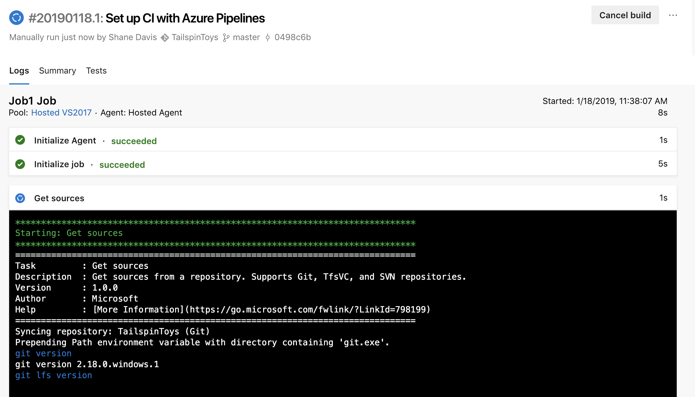
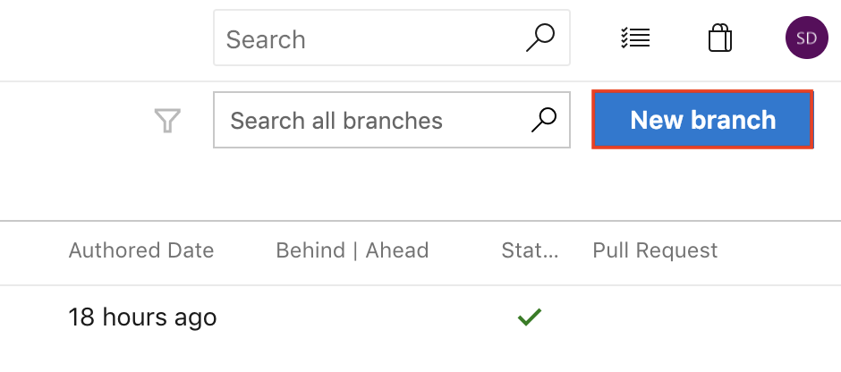

<div class="MCWHeader1">
Continuous delivery in Azure DevOps
</div>

<div class="MCWHeader2">
Hands-on lab step-by-step
</div>

<div class="MCWHeader3">
April 2019
</div>

Information in this document, including URL and other Internet Web site references, is subject to change without notice. Unless otherwise noted, the example companies, organizations, products, domain names, e-mail addresses, logos, people, places, and events depicted herein are fictitious, and no association with any real company, organization, product, domain name, e-mail address, logo, person, place or event is intended or should be inferred. Complying with all applicable copyright laws is the responsibility of the user. Without limiting the rights under copyright, no part of this document may be reproduced, stored in or introduced into a retrieval system, or transmitted in any form or by any means (electronic, mechanical, photocopying, recording, or otherwise), or for any purpose, without the express written permission of Microsoft Corporation.

Microsoft may have patents, patent applications, trademarks, copyrights, or other intellectual property rights covering subject matter in this document. Except as expressly provided in any written license agreement from Microsoft, the furnishing of this document does not give you any license to these patents, trademarks, copyrights, or other intellectual property.

The names of manufacturers, products, or URLs are provided for informational purposes only and Microsoft makes no representations and warranties, either expressed, implied, or statutory, regarding these manufacturers or the use of the products with any Microsoft technologies. The inclusion of a manufacturer or product does not imply endorsement of Microsoft of the manufacturer or product. Links may be provided to third party sites. Such sites are not under the control of Microsoft and Microsoft is not responsible for the contents of any linked site or any link contained in a linked site, or any changes or updates to such sites. Microsoft is not responsible for webcasting or any other form of transmission received from any linked site. Microsoft is providing these links to you only as a convenience, and the inclusion of any link does not imply endorsement of Microsoft of the site or the products contained therein.

© 2019 Microsoft Corporation. All rights reserved.

Microsoft and the trademarks listed at https://www.microsoft.com/en-us/legal/intellectualproperty/Trademarks/Usage/General.aspx are trademarks of the Microsoft group of companies. All other trademarks are property of their respective owners.

**Contents**
<!-- TOC -->

- [Continuous delivery in Azure DevOps hands-on lab step-by-step](#continuous-delivery-in-azure-devops-hands-on-lab-step-by-step)
  - [Abstract and learning objectives](#abstract-and-learning-objectives)
  - [Overview](#overview)
  - [Solution architecture](#solution-architecture)
  - [Requirements](#requirements)
  - [Exercise 1: Create an Azure Resource Manager (ARM) template that can provision the web application, SQL database, and deployment slots in a single automated process](#exercise-1-create-an-azure-resource-manager-arm-template-that-can-provision-the-web-application-sql-database-and-deployment-slots-in-a-single-automated-process)
    - [Task 1: Create an Azure Resource Manager (ARM) template using Visual Studio](#task-1-create-an-azure-resource-manager-arm-template-using-visual-studio)
    - [Task 2: Add an Azure SQL database and server to the template](#task-2-add-an-azure-sql-database-and-server-to-the-template)
    - [Task 3: Add a web hosting plan and web app to the template](#task-3-add-a-web-hosting-plan-and-web-app-to-the-template)
    - [Task 4: Add Application Insights to the template](#task-4-add-application-insights-to-the-template)
    - [Task 5: Configure automatic scale for the web app in the template](#task-5-configure-automatic-scale-for-the-web-app-in-the-template)
    - [Task 6: Configure the list of release environments parameters](#task-6-configure-the-list-of-release-environments-parameters)
    - [Task 7: Configure the name of the web app using the environments parameters](#task-7-configure-the-name-of-the-web-app-using-the-environments-parameters)
    - [Task 8: Add a deployment slot for the "staging" version of the site](#task-8-add-a-deployment-slot-for-the-%22staging%22-version-of-the-site)
    - [Task 9: Create the dev environment and deploy the template to Azure](#task-9-create-the-dev-environment-and-deploy-the-template-to-azure)
    - [Task 10: Create the test environment and deploy the template to Azure](#task-10-create-the-test-environment-and-deploy-the-template-to-azure)
    - [Task 11: Create the production environment and deploy the template to Azure](#task-11-create-the-production-environment-and-deploy-the-template-to-azure)
  - [Exercise 2: Create Azure DevOps project and Git Repository](#exercise-2-create-azure-devops-project-and-git-repository)
    - [Task 1: Create Azure DevOps Account](#task-1-create-azure-devops-account)
    - [Task 2: Add the Tailspin Toys source code repository to Azure DevOps](#task-2-add-the-tailspin-toys-source-code-repository-to-azure-devops)
  - [Exercise 3: Create Azure DevOps build pipeline](#exercise-3-create-azure-devops-build-pipeline)
    - [Task 1: Turn on preview features](#task-1-turn-on-preview-features)
    - [Task 2: Create a build pipeline](#task-2-create-a-build-pipeline)
  - [Exercise 4: Create Azure DevOps release pipeline](#exercise-4-create-azure-devops-release-pipeline)
    - [Task 1: Create a release definition](#task-1-create-a-release-definition)
    - [Task 2: Add test and production environments to release pipeline](#task-2-add-test-and-production-environments-to-release-pipeline)
  - [Exercise 5: Trigger a build and release](#exercise-5-trigger-a-build-and-release)
    - [Task 1: Manually queue a new build and follow it through the release pipeline](#task-1-manually-queue-a-new-build-and-follow-it-through-the-release-pipeline)
  - [Exercise 6: Create a feature branch and submit a pull request](#exercise-6-create-a-feature-branch-and-submit-a-pull-request)
    - [Task 1: Create a new branch](#task-1-create-a-new-branch)
    - [Task 2: Make a code change to the feature branch](#task-2-make-a-code-change-to-the-feature-branch)
    - [Task 3: Submit a pull request](#task-3-submit-a-pull-request)
    - [Task 4: Approve and complete a pull request](#task-4-approve-and-complete-a-pull-request)
  - [After the hands-on lab](#after-the-hands-on-lab)
    - [Task 1: Delete resources](#task-1-delete-resources)

<!-- /TOC -->

# Continuous delivery in Azure DevOps hands-on lab step-by-step

## Abstract and learning objectives 

In this hands-on lab, you will learn how to implement a solution with a combination of Azure Resource Manager templates and Azure DevOps to enable continuous delivery with several Azure PaaS services.

At the end of this workshop, you will be better able to implement solutions for continuous delivery with Azure DevOps in Azure, as well create an Azure Resource Manager (ARM) template to provision Azure resources, configure continuous delivery with Azure DevOps, configure Application Insights into an application, and create an Azure DevOps project and Git repository.

## Overview

Tailspin Toys has asked you to automate their development process in two specific ways. First, they want you to define an Azure Resource Manager template that can deploy their application into the Microsoft Azure cloud using Platform-as-a-Service technology for their web application and their SQL database. Second, they want you to implement a continuous delivery process that will connect their source code repository into the cloud, automatically run their code changes through unit tests, and then automatically create new software builds and deploy them onto environment-specific deployment slots so that each branch of code can be tested and accessed independently.

## Solution architecture


## Requirements

1.  Microsoft Azure subscription

2.  Local machine or a virtual machine configured with:

    -   Visual Studio Community 2017

    -   Git command-line interface (CLI)

## Exercise 1: Create an Azure Resource Manager (ARM) template that can provision the web application, SQL database, and deployment slots in a single automated process

Duration: 45 Minutes

Tailspin Toys has requested three Azure environments (dev, test, production), each consisting of the following resources:

-   App Service

    -   Web App

        -   Auto-scale rule

    -   Deployment slots (for zero-downtime deployments)

-   SQL Server

    -   SQL Database

-   Application Insights

Since this solution is based on Azure Platform-as-a-Service (PaaS) technology, it should take advantage of that platform by utilizing automatic scale for the web app and the SQL Database PaaS service instead of SQL Server virtual machines.

### Task 1: Create an Azure Resource Manager (ARM) template using Visual Studio

1.  Open Visual Studio and create a new project of the type Cloud -- Azure Resource Group. Name the new project "TailspinToys.AzureResourceTemplate" and save it to **C:\\Hackathon**. Also, make sure that only the "Create directory for solution" option is checked on the lower right, as in the screen shot below. When finished, click **OK**.
    
    

2.  On the next window, click **Blank Template**, and click **OK**.
    
    

3.  In the Solution Explorer window, open the azuredeploy.json file by double-clicking it.
    
    

4.  Then, probably on the left side of the Visual Studio window, open the window called JSON Outline. It will look like this screen shot:
    
    

5.  Save your files.

### Task 2: Add an Azure SQL database and server to the template

1.  Right-click on the **resources** item in the **JSON Outline** and click **Add New Resource**.
    
    

2.  Select **SQL Server** and give it a name like "tailspinsql", then click **Add**.

    

3.  Now that the SQL Server has been created as a resource, right-click that SQL Server resource and choose **Add New Resource** so that you can add a database.
    
    

4.  Choose SQL Database, and call it "TailspinData." Make sure that your server is selected in the drop-down list below, and click **Add**.
    
    

### Task 3: Add a web hosting plan and web app to the template

1.  Add another resource, this time choose **App Service Plan**, and call it "TailspinToysHostingPlan", followed by clicking **Add**.
    
    

2.  Right-click the hosting plan resource and add a new resource underneath it.
    
    

3.  Choose **Web App**, name it "TailspinToysWeb", make sure your hosting plan is selected in the drop-down list, and then click **Add**.
    
    

### Task 4: Add Application Insights to the template

1.  Add a new resource to the template, this time choose **Application Insights for Web Apps**. Make sure your correct hosting plan and web app are selected in the boxes. Name the Application Insights resource "TailspinToysWeb" and then click **Add**.
    
    
    
    Notice that the json file has been modified. Navigate to the JSON Editor and change the **"location": "East US"**, to **"location": "[resourceGroup().location]"**.

2.  Next, you need to add the Application Insights extension to the App Service so that it will be running automatically once the site is deployed. This is going to require some manual code because there is not a wizard for this resource type. Click on the TailspinToysWeb web app resource to locate its JSON code. Then, just below the "properties" property, paste or type in this block of JSON code.
    ```
    "resources": [
        {
        "apiVersion": "2015-08-01",
        "name": "Microsoft.ApplicationInsights.AzureWebSites",
        "type": "siteextensions",
        "tags": {
            "displayName": "Application Insights Extension"
        },
        "dependsOn": [
            "[resourceId('Microsoft.Web/Sites/', variables('TailspinToysWebName'))]",
            "[resourceId('Microsoft.Insights/components/', 'TailspinToysWeb')]"
        ],
        "properties": {
        }
        }
    ]
    ```

    It will look something like this screen shot:

    

### Task 5: Configure automatic scale for the web app in the template

1.  Click on the resource called "TailspinToysWeb AutoScale" to see its JSON value.
    
    

2.  In the main window, scroll down a little to find the "enabled" property of the auto scale rule. Change it from "false" to "true." You can examine the other settings in this JSON value to understand the setting. It defaults to increasing the instance count if the CPU goes above 80% for a while and reduces the instance count if the CPU falls below 60% for a while.
    
    

### Task 6: Configure the list of release environments parameters

1.  Next, you need to configure the list of release environments we'll be deploying to. Our scenario calls for adding three environments: dev, test, and production. This is going to require some manual code because there is not a wizard for this resource type. Click on the parameters item in the JSON Outline window to locate its JSON code. Then, add this code as the first element inside the of the "parameters" object.
    ```
    "environment": {
          "type": "string",
          "defaultValue": "dev",
          "allowedValues": [
            "dev",
            "test",
            "production"
          ]
    },
    ```

    After adding the code, it will look like this:

    

### Task 7: Configure the name of the web app using the environments parameters

1.  Next, you need to configure the template so that it dynamically generates the name of the web application based on the environment it is being deployed to. Click on the variables item in the JSON Outline window to locate its JSON code. Then, location the "variables" section and replace the corresponding TailspinToysWebName value with the following code:

    ```
        "TailspinToysWebName": "[concat('TailspinToysWeb', '-', parameters('environment'), '-', uniqueString(resourceGroup().id))]"},
    ```

    After adding the code, it will look like this:

    

### Task 8: Add a deployment slot for the "staging" version of the site

1.  Next, you need to add the "staging" deployment slot to the web app. This is used during a deployment to stage the new version of the web app. This is going to require some manual code because there is not a wizard for this resource type. Click on the TailspinToysWeb web app resource to locate its JSON code. Then, add this code to the "resources" array, just below the element for the application insights extension.

    ```
    {
        "apiVersion": "2015-08-01",
        "name": "staging",
        "type": "slots",
        "tags": {
        "displayName": "Deployment Slot: staging"
        },
        "location": "[resourceGroup().location]",
        "dependsOn": [
        "[resourceId('Microsoft.Web/Sites/', variables('TailspinToysWebName'))]"
        ],
        "properties": {
        },
        "resources": []
    }
    ```
    It will look something like this screen shot:

    

### Task 9: Create the dev environment and deploy the template to Azure

1.  First, before you deploy the template, you need to make sure that you can get the instrumentation key from the Application Insights resource because you will need it later. To do this, you can add an output property to the template. Go the "outputs" area of the template and paste or type in this JSON code.

    ```
        "MyAppInsightsInstrumentationKey": {
            "value": "[reference(resourceId('Microsoft.Insights/components', 'TailspinToysWeb'), '2014-04-01').InstrumentationKey]",
            "type": "string"
            }
    ```
2.  Now, save all your files.

3.  Right-click the project in Solution Explorer and choose "Deploy" and then "New..."

    

4.  Sign in to your Azure account if necessary, and then choose your correct subscription. Under Resource group, choose "Create New..." and create a new resource group for this deployment. Since we are creating a dev environment, let us name it "TailspinToys-dev." Choose a location near you.
  
    
    
    

5.  Once you have the resource group created, click the **Edit Parameters** button.

    

6.  In the next window, select "dev" from the list of environments. Then, pick an admin username, and password for the database, it does not matter what you choose. Then use "TailspinData" for the TailspinDataName value. Call the hosting plan "TailspinHostingPlan1" and choose "S1" for the Sku. Finally, be sure to check the "Save passwords..." option at the bottom See this screen shot for help. When finished, click Save.
    
    

7.  Then, click the **Deploy** button on the deployment window.
    
    

8.  If we have done everything correct, the deployment will begin. You can watch the output window inside Visual Studio to follow along. This deployment typically takes a few minutes. Upon completion, you should see success and you should see an instrumentation key be written out in the output window. Copy this down for a future step in this process. 

>**Note:** Your key will be different from the one shown in this screen shot.
    
   

### Task 10: Create the test environment and deploy the template to Azure

The following steps are very similar to what was done in the previous task with the exception that you are now creating the test environment

1.  Right-click the project in Solution Explorer and choose "Deploy" and then "New..."

    

2.  Sign in to your Azure account if necessary, and then choose your correct subscription. Under Resource group, choose "Create New..." and create a new resource group for this deployment. Since we are creating a test environment, let us name it "TailspinToys-test." Choose a location near you.

    
    
    

3.  Once you have the resource group created, click the **Edit Parameters** button.

    

4.  In the next window, select "test" from the list of environments. Then, pick an admin username, and password for the database, it does not matter what you choose. Then use "TailspinData" for the TailspinDataName value. Call the hosting plan "TailspinHostingPlan1" and choose "S1" for the Sku. Finally, be sure to check the "Save passwords..." option at the bottom See this screen shot for help. When finished, click Save.

    

5.  Then, click the **Deploy** button on the deployment window.

    

6.  If we have done everything correct, the deployment will begin. You can watch the output window inside Visual Studio to follow along. This deployment typically takes a few minutes. Upon completion, you should see success and you should see an instrumentation key be written out in the output window. Copy this down for a future step in this process. 

>**Note:** Your key will be different from the one shown in this screen shot.

   

### Task 11: Create the production environment and deploy the template to Azure

The following steps are very similar to what was done in the previous task with the exception that you are now creating the production environment.

1.  Right-click the project in Solution Explorer and choose "Deploy" and then "New..."

    

2.  Sign in to your Azure account if necessary, and then choose your correct subscription. Under Resource group, choose "Create New..." and create a new resource group for this deployment. Since we are creating a production environment, let us name it "TailspinToys-prod." Choose a location near you.

    
    
    

3.  Once you have the resource group created, click the **Edit Parameters** button.

    

4.  In the next window, select "production" from the list of environments. Then, pick an admin username, and password for the database, it does not matter what you choose. Then use "TailspinData" for the TailspinDataName value. Call the hosting plan "TailspinHostingPlan1" and choose "S1" for the Sku. Finally, be sure to check the "Save passwords..." option at the bottom See this screen shot for help. When finished, click Save.

    

5.  Then, click the **Deploy** button on the deployment window.
    
    

6.  If we have done everything correct, the deployment will begin. You can watch the output window inside Visual Studio to follow along. This deployment typically takes a few minutes. Upon completion, you should see success and you should see an instrumentation key be written out in the output window. Copy this down for a future step in this process. 

>**Note:** Your key will be different from the one shown in this screen shot.
    
   

7.  If you visit the Azure Portal for your Azure subscription, you should now see the three newly created resource groups.

    

## Exercise 2: Create Azure DevOps project and Git Repository

Duration: 15 Minutes

In this exercise, you will create and configure an Azure DevOps account along with an Agile project.

### Task 1: Create Azure DevOps Account

1.  Browse to the Azure DevOps site at <https://dev.azure.com>.

2.  If you do not already have an account, click the **Start free** button.
    
    

3.  Authenticate with a Microsoft account.

4.  Click **Continue** to accept the Terms of Service, Privacy Statement, and Code of Conduct.

5.  Choose a name for new your project. For the purposes of this scenario, we will use "TailspinToys". Choose **Private** in the Visibility section so that our project is only visible to those who we specifically grant access. Then, click **+ Create project**.
    
    

6.  Once the Project is created, click on the **Repos** menu option in the left-hand navigation.

    

7.  On the **Repos** page for the **TailspinToys** repository, locate the "or push an existing repository from command line" section. Click the Copy button to copy the contents of the panel. We're going to use these commands in an upcoming step.

    
    

### Task 2: Add the Tailspin Toys source code repository to Azure DevOps

In this Task, you will configure the Azure DevOps Git repository. You will configure the remote repository using Git and then push the source code up to Azure DevOps through the command line tools.

1.  Open a command prompt in the **C:\\Hackathon** folder.

    > **Note**: If this folder doesn't exist ensure you followed the instructions in the Before the HOL.

2.  Initialize a local Git repository by running the following command at the command prompt:

    > If a ".git" folder and local repository already exists in the folder, then you will need to delete the ".git" folder first before running the commands below to initialize the Git repository.

    ```
    git init
    ```

3.  Paste the first command you copied from Azure DevOps. It will resemble the command below:
    
    ```
    git remote add origin https://<your-org>@dev.azure.com/<your-org>/TailspinToys/_git/TailspinToys
    ```

4.  Enter the following commands to commit the changes made locally to the new repository:
    
    ```
    git add *
    git commit -m "adding files"
    ```

5.  Push the changes up to the Azure DevOps repository with the following command:

    ```
    git push -u origin --all
    ```

6.  Leave that command prompt window open and switch back to the web browser window for Azure DevOps from the previous Task. Navigate to the Repos > Files page which shows the files in the repository. You may need to refresh the page to see the updated files. Your source code is now appearing in Azure DevOps.

## Exercise 3: Create Azure DevOps build pipeline

Duration: 15 Minutes

Implementing CI and CD pipelines helps to ensure consistent and quality code that's readily available to users. Azure Pipelines is a quick, easy, and safe way to automate building your projects and making them available to users,

In this exercise, you will create a build definition using, Azure Pipelines, that will automatically build the web application with every commit of source code. This will lay the groundwork for us to then create a release pipeline for publishing the code to our Azure environments.

### Task 1: Turn on preview features

1.  In order to complete the following tasks, you'll need to first enable a couple preview features in Azure DevOps. Start by clicking the profile link in the top right-hand side of the screen and then select **Preview features**.

    

2.  In the Preview features panel, toggle **On** the following features:
    - New release progress views
    - New Releases Hub
    - New YAML pipeline creation experience

    

3.  Close the Preview features panel.
  
### Task 2: Create a build pipeline

1.  In your Azure DevOps project, select the Pipelines menu option from the left-hand navigation.

    

2.  Click the **New pipeline** button to create a new build pipeline.

    

3.  This starts a wizard where you'll first need to select where your current code is located. In a previous step, you pushed code up to Azure Repos. Select the **Azure Repos Git** option.

    

4.  Next, you'll need to select the specific repository where your code was pushed. In a previous step, you pushed it to the **TailspinToys** repository. Select the **TailspinToys** git repository.

    

5.  Then, you'll need to select the type of pipeline to configure. Since the Tailspin Toys solution is an ASP.NET web application, select **ASP.NET** from the list of options.

    

6.  As a final step in the creation of a build pipeline, you are presented with a configured pipeline in the form of an azure-pipelines.yml file. The YAML file contains the instructions for the pipeline. Inspect the file to understand how tasks are defined in the **Steps:** section. This file contains four tasks. 

7.  We also need to publish the output of the build pipeline so it can be used in our release pipeline. To do that, we'll add a task to the end of the current build pipeline. Add an additional task by inserting the following code at the end of the azure-pipelines.yml file.

    ```yml
    - task: PublishBuildArtifacts@1
      inputs:
        pathtoPublish: '$(Build.ArtifactStagingDirectory)' 
        artifactName: 'TailspinToys-CI'
    ```

8.  The final result will look like the following:

    ```yml
    # ASP.NET
    # Build and test ASP.NET projects.
    # Add steps that publish symbols, save build artifacts, deploy, and more:
    # https://docs.microsoft.com/azure/devops/pipelines/apps/aspnet/build-aspnet-4

    trigger:
    - master

    pool:
    vmImage: 'VS2017-Win2016'

    variables:
    solution: '**/*.sln'
    buildPlatform: 'Any CPU'
    buildConfiguration: 'Release'

    steps:
    - task: NuGetToolInstaller@0

    - task: NuGetCommand@2
    inputs:
        restoreSolution: '$(solution)'

    - task: VSBuild@1
    inputs:
        solution: '$(solution)'
        msbuildArgs: '/p:DeployOnBuild=true /p:WebPublishMethod=Package /p:PackageAsSingleFile=true /p:SkipInvalidConfigurations=true /p:PackageLocation="$(build.artifactStagingDirectory)"'
        platform: '$(buildPlatform)'
        configuration: '$(buildConfiguration)'

    - task: VSTest@2
    inputs:
        platform: '$(buildPlatform)'
        configuration: '$(buildConfiguration)'

    - task: PublishBuildArtifacts@1
    inputs:
        pathtoPublish: '$(Build.ArtifactStagingDirectory)' 
        artifactName: 'TailspinToys-CI'
    ```

9.  Click the **Save and run** button to save our new pipeline and also kick off the first build.

        

10. The new azure-pipelines.yml file will automatically be added to the root of your TailspinToys repository. This is done through a git commit that Azure DevOps facilitates. You are then asked to enter a commit description. By default, it will be populated for you. Once again, click the **Save and run** button at the bottom of the screen.

       

11. The build process will immediately begin and run through the steps defined in the azure-pipelines.yml file. Your Azure DevOps screen will refresh to show you the build process executing, in real-time.
   
      

      

12.  After the build process completes, you should see a green check mark next to each of the build pipeline steps.

    

13. Congratulations! You have just created your first build pipeline. In the next exercise, we will create a release pipeline that deploys your successful builds.

## Exercise 4: Create Azure DevOps release pipeline

Duration: 30 Minutes

In this exercise, you will create a release pipeline in Azure DevOps that performs automated deployment of build artifacts to Microsoft Azure. The release pipeline will deploy to three stages: dev, test, and production.

### Task 1: Create a release definition

1.  Click **Releases** on the left-hand navigation. This will bring up the Releases screen. 

    

2.  Click on the **New pipeline** button to begin the creation of a new release pipeline.

    

3.  Then, you'll need to select the template that matches the pipeline you are building. Since we are deploying an Azure App Service, select **Azure App Service deployment** from the list of templates and click the **Apply** button.

    

4.  This will present you with the New release pipeline editor which allows you to manage your release stages. A stage is a logical and independent concept that represents where you want to deploy a release generated from a release pipeline. Often times, this is considered an environment. Let's start by giving this stage a name. Change the value "Stage 1" in the editor to "dev" and then click the "X" in the top-right corner to close the panel and save the name change.

    

5.  A release consists of a collection of artifacts in your CD/CD process. An artifact is any deployable component of your application. When authoring a release pipeline, you link the appropriate artifact sources to your release pipeline. In this step, we will connect the artifacts from our previously created build pipeline to this newly created release pipeline. Click on the "+ Add" button next to "Artifacts" or the "+ Add an artifact" icon inside the "Artifacts" box. Both buttons perform the same action.

    

6.  The Add an artifact panel will display several configurations for linking to an artifact. In the **Source (build pipeline)** dropdown list, select **TailspinToys**. The panel fields will adjust to show additional details based on your selection. The default values will produce a new release when future builds successfully complete. Click the **Add** button.

    

7.  Now, it is time to begin configuring specific tasks to perform our deployment during the dev stage. To navigate to the task editor, click on the **Task** menu item.

    

8.  This brings up the task editor and opens a panel with configuration details for the dev stage we created earlier. The configuration items set here will be made available to the tasks in this stage.

9.  On this panel, we first need to configure the necessary details to connect the task to Azure for deployment. Let's first start by connecting to our Azure subscription. Select your Azure subscription from the "Azure subscription" dropdown and then click the **Authorize** button to login and authenticate to the selected subscription.

    

10. Then, in the "App service name field" select the one that begins with **TailspinToysWeb-dev-**.

    

11. Now, let's configure the task specific details. Click on the "Deploy Azure App Service" task to bring up the configuration panel for task.

    

12. In a previous exercise, we created a deployment slot for the web app. Deployment slots are actually live apps with their own hostnames. App content and configuration elements can be swapped between two deployment slots, including the production slot. In the "Azure App Service Deploy" panel, locate the **Deploy to slot** checkbox and click it to checked.

    

13. The checkbox will trigger the panel to update with additional configuration items. In the **Resource group** dropdown, select **TailspinToys-dev**. In the **Slot** dropdown, select **staging**.

    

14. Now that we've completed the configuration for the "Deploy Azure App Service" task to deploy our application to Azure App Service deployment slot, we'll need a way to swap the staging slot with the production slot. To do that, we'll need to add an additional task to the dev stage. Click the **+** (plus sign) on the task list to create a new task.

    

15. This opens the "Add tasks" panel. Enter **App Service Manage** into the search box and press **Enter**. Then select the **Azure App Service Manage** task from the search results and click the **Add** button.

    

16. After adding the new task, we now have two tasks for the dev stage. The new task now needs to be configured. Click on the **Swap Slots:** task to open the task configuration panel.

    

17. In the "Azure App Service Manage" task panel there are a few configurations we need to set. First, locate the "Azure subscription" field and select the same subscription used in the "Deploy Azure App Service" task.

18. Locate the "App Service name" field, select the item that begins with **TailspinToysWeb-dev-** just like in the "Deploy Azure App Service" task. In the "Resource Group" field, select **TailspinToys-dev**. In the "Source Slot" field, select **staging**.

    

19. Let's wrap up this activity by giving our release pipeline a new name. Click on the existing "New release pipeline" name to begin editing it. Change the name to "TailspinToys Release".

    

20. Click the "Save" button at the top of the screen and confirm by clicking the "OK" button.

21. Congratulations! You have just created your first release pipeline.

### Task 2: Add test and production environments to release pipeline

1.  Move your mouse over the dev stage and a click the **Clone** button to create a copy of the tasks from the dev stage. We will use the same steps to deploy to test with a few configuration changes.

    

2.  Click on the newly created stage titled "Copy of dev" to bring up the stage configuration panel.

3.  Change the "Stage name" to **test** and then close the panel.

    

4.  Now, we will begin modifying the configuration specifics for the test stage. Click the "1 job, 2 tasks" link for the test stage.

    

5.  This opens the configuration panel for the stage and includes several pre-populated fields. Locate the **App service name** field and change the value to the app service that starts with **TailspinToysWeb-test-**.

    

6.  Select the "Deploy Azure App Service" task to bring up the task configuration panel. Notice the settings are the same as when we configured it for the dev stage because we cloned the dev stage to create the test stage. You may need to scroll down the panel to see additional fields.

7.  Locate the **Resource group** field and select **TailspinToys-test**. Then, locate the **Slot** field and select **staging**.

    

8.  Now, select the "Swap Slots" task to bring up the task configuration panel. First, locate the **Display name** field and simplify it to **Swap Slots**. Then, locate the **App Service name** and select the app service that starts with **TailspinToys-test-**. Next, locate the **Resource group** field and change the value to **TailspinToys-test**. Finally, locate the **Source Slot** field and set it to **staging**.

    

9.  Click the "Save" button at the top of the screen, and confirm by clicking the "OK" button.

10. Congratulations! You have just created a test stage and added it to your pipeline.

11. Repeat all of the steps in Task 2 to create a production stage being careful to enter "production" as a replacement for "test" and selecting "TailspinWeb-production" instead of "TailspinWeb-test" where applicable. Do not forget to configure to individual steps in the newly cloned production environment.

12. The final release pipeline should look like the screen shot below:

    

13. Now you will enable the continuous deployment trigger, so the release process automatically begins as soon as a build successfully completes. To do this, click on the lightning bolt icon in the Artifacts window.

14. This will bring up the Continuous deployment trigger panel. Change the setting to "Enabled".

    

15. Click Save, and confirm your changes by clicking "OK". Then, close the panel.

16. Congratulations! You have completed the creation of a release pipeline with three stages.

## Exercise 5: Trigger a build and release

Duration: 10 Minutes

In this exercise, you will trigger an automated build and release of the web application using the build and release pipelines you created in earlier exercises. The release pipeline will deploy to three stages: dev, test, and production.

Any commit of new or modified code to the master branch will automatically trigger a build. The steps below are useful when you want to manually trigger a build without a code change.

### Task 1: Manually queue a new build and follow it through the release pipeline

1.  Click on the "Pipelines" menu item from the left-hand navigation. Then, click the "Queue" button.

    

2.  This will present a popup titled "Queue build for TailspinToys". Click the "Queue" button at the bottom of the popup.

    

3. Double-click the build view the status of the build.

    

4.  If the build is successful, it will resemble the screen shot below.

    

5.  Because we configured continuous deployment, the deployment to the dev stage will then be triggered immediately. It will continue through on to the test and production stages. A successful release through all three stages will look like the screen shot below.

    

## Exercise 6: Create a feature branch and submit a pull request

Duration: 20 Minutes

In this exercise, you will create a short-lived feature branch, make a small code change, commit the code, and submit a pull request. You'll then merge the pull request into the master branch which triggers an automated build and release of the application.

In the tasks below, you will make changes directly through the Azure DevOps web interface. These steps could also be performed through the Visual Studio IDE.

### Task 1: Create a new branch

1.  Select the "Repos" menu item from the left-hand navigation. Then, click on "Branches".

    

2.  Click the "New branch" button in the upper right corner of the page.

    

3.  In the "Create a branch" dialog, enter a name for the new branch. In this scenario, name it "new-heading". In the "Based on" field, be sure **master** is selected.

    

4.  Click "Create branch".

### Task 2: Make a code change to the feature branch

1.  Click on the name of the newly created branch. This will present the "Files" window showing all the files in the repository.

    

2.  Next, you'll make a change to a page in the web application inside the web browser.

3.  Click on the "TailspinToys.Web" folder.

4.  Then, click on the "Views" folder.

5.  Then, click on the "Home" folder.

6.  Locate and click on the "Index.cshtml" file. It will display the contents of the file.

7.  Click on the "Edit" button on the top right of the screen to begin editing the page.

    

8.  Replace the code ```<h1>ASP.NET</h1>``` on line 6 with the following:

    ```
    <h1>Tailspin Toys</h1>
    ```
    
9.  Now that you've completed the code change, click on the "Commit..." button on the top right side of the screen.

    

10. This will present the Commit popup where you can enter a comment. Click the "Commit" button.

    

### Task 3: Submit a pull request

1.  Near the top of the screen, locate the "Create a pull request" link.

    

2.  This brings up the "New Pull Request" page. It shows we are submitting a request to merge code from our **new-heading** branch into the **master** branch. You have the option to change the "Title" and "Description" fields. Locate the "Reviewers" field. Type in **Tailspin** and click the search tooltip. Select the **[TailspinToys]\Tailspin Toys** team from the search results. This assigns The TailspinToys Team (which you are a member of) to review this pull request before it will be merged. The details of the code change are at the bottom of the page.

    

3.  Click the "Create" button to submit the pull request.

### Task 4: Approve and complete a pull request

Typically, the next few steps would be performed by another team member. This would allow for the code to be peer reviewed. However, in this scenario, you will continue as if you are the only developer on the project.

1.  After submitting the pull request, you are presented with Pull Request review screen. Let's assume all the changes made were acceptable to the review team.

2.  First, click the "Approve" button to approve of the code that was modified submitted as part of the pull request.

3.  This will note that you approved the pull request. Then, click the "Complete" button to finish and merge the code from the pull request into the master branch.

    

4.  After clicking the Complete button in the previous step, you will be presented with the Complete pull request popup. You can add additional comments for the merge activity. By selecting the "Delete new-heading after merging" option, our branch will be deleted after the merge has been completed. This keeps our repository clean of old and abandoned branches and eliminates the possibility of future confusion.

    

5.  Click the "Complete merge" button.

6.  You will then see a confirmation of the completed pull request.

    

7.  Congratulations! You just created a branch, made a code change, submitted a pull request, approved the pull request, and merged the code.

8.  Because we configured continuous integration and continuous deployment, an automated build will be triggered and deployment to dev stage will then begin immediately after a successful build. It will continue through on to the test and production stages.

    

## After the hands-on lab

Duration: 10 Minutes

### Task 1: Delete resources

1.  Now since the hands-on lab is complete, go ahead and delete all of the Resource Groups that were created for this hands-on lab. You will no longer need those resources and it will be beneficial to clean up your Azure Subscription.

These steps should be followed only *after* completing the hands-on lab.
